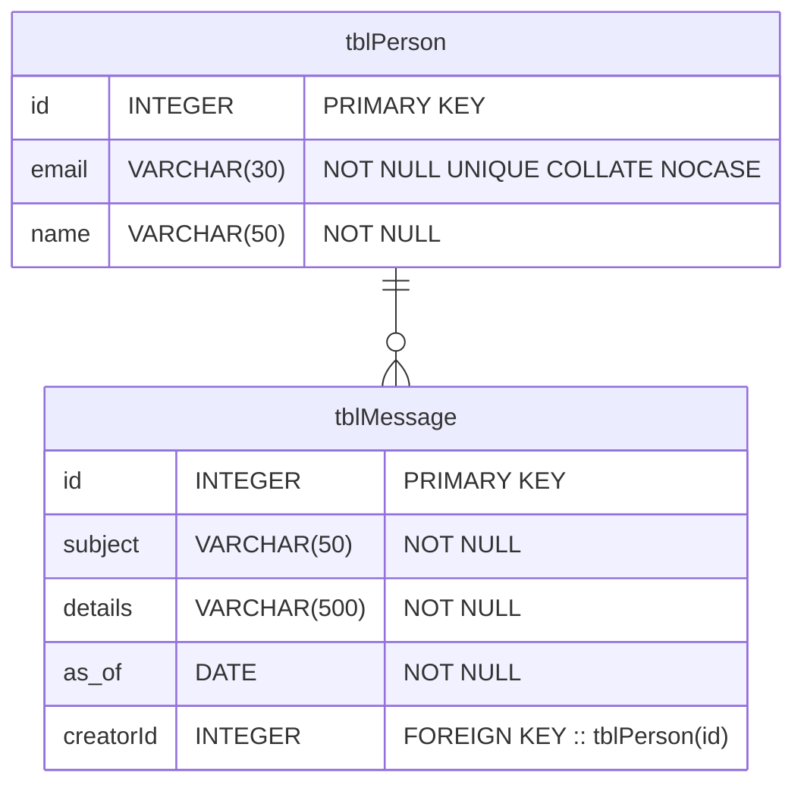
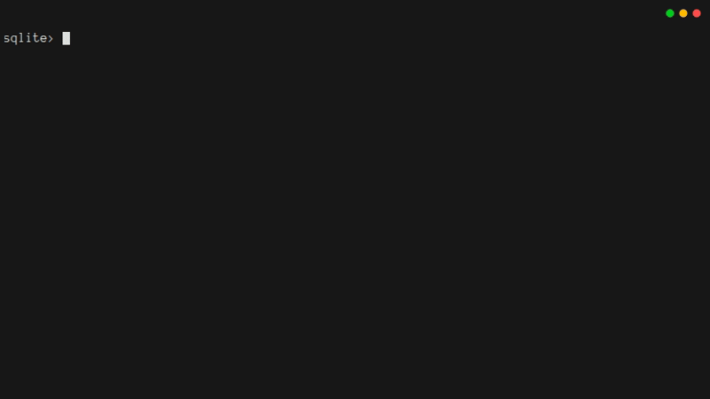
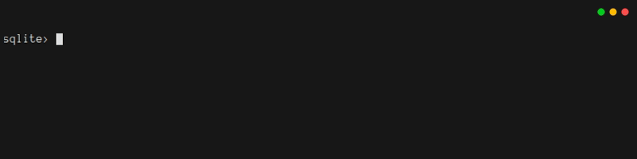
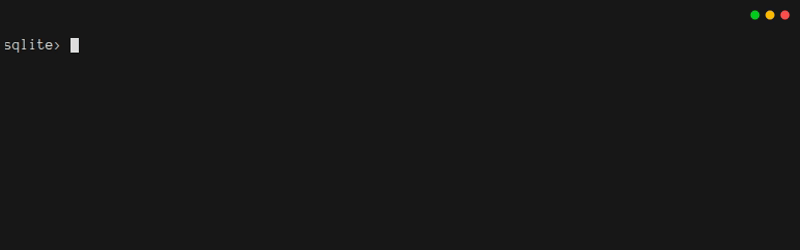
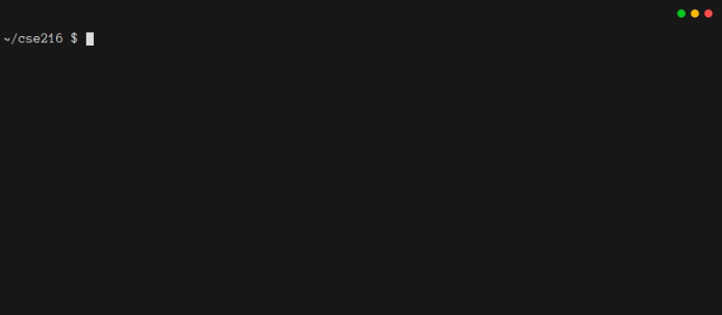
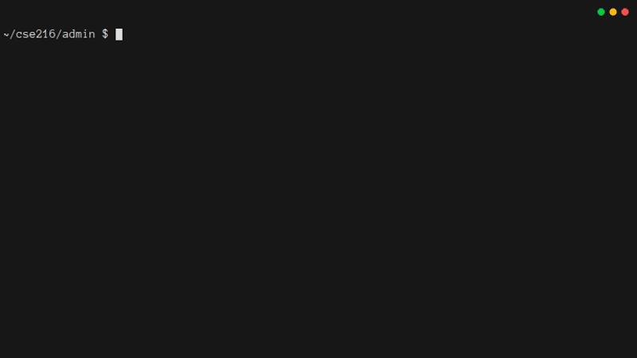

# 1. Introduction To Databases

## 1.1. Introduction

In any app, it is important to have a way to save data and to retrieve saved data.
You probably know how to save and retrieve data by using files.
Unfortunately, files are difficult to use well:

- Files do not have inherent structure, so you have to manually organize the data in your program's files
- Files do not have types, so you have to translate between a file's bytes and your program's objects
- Files do not check themselves for bugs, so you have to manually ensure that the contents of your files have not been corrupted
- Files do not have built-in support for analyzing their contents or understanding relationships among their parts

Many programs work with data that has an underlying structure.
Databases are designed to make it easy to work with structured data.
Using a database instead of files can make your code more powerful, more maintainable, and simpler.

Consider a list of all of your friends and their birthdays.
If you store that information in a database, you can ask the database for all of the January birthdays *in just one line of code*, and the database will return a structured, strongly typed object with the result.
The language used by databases, SQL, can do much more, including aggregation, bulk updates, and finding specific data.

In this chapter, you will use the [SQLite](https://sqlite.org/) database.
SQLite is one of the most popular programs in the world.
You probably have at least 5 copies of SQLite embedded inside of apps on your phone.
SQLite is relational, which makes it easy to manage complex data without significant effort.
Best of all, SQLite is easy to set up and use.

Hopefully, by now you are thinking "I want that".


:::warning Warning: SQLite Has Limitations
SQLite is *not* a database for web applications that run in the cloud.
When you get to Chapter 4, you'll learn how to switch from SQLite to [PostgreSQL](https://www.postgresql.org/).
:::

## 1.2. Tables, Keys, And Views

Databases organize data in **tables**.
A table has rows and columns (like a spreadsheet).
You can think of a table as an array of objects:

- The definition of the table is like the definition of a class (i.e. its name and data members)
- Each column is a field of the object
- Each row is an object instance

When organizing your data in tables, it helps for each row of a table to have a unique identifier.
Databases call these identifiers **primary keys**.
When you're just getting started, you can probably give a unique integer value to each row, and use that as the primary key.

There is another type of key, a **foreign key**.
If a column is a foreign key, it is associated with the primary key of some other table.
Foreign keys create the *relations* in *relational databases*.
They let you create one-to-one, one-to-many, many-to-one, or many-to-many relationships between rows of different tables.

When a table is related to another table through primary and foreign keys, you can query the database to get a row from one table, and all associated rows from another table.
Your program will probably want to use the same *query* code over and over again.
Databases let you represent these re-usable queries as **views**.

## 1.3. Designing A Data Model

In this tutorial you will learn how to make a secure online message board.
Users will be able to log into the message board and Create/Read/Update/Delete messages.
You will need two tables: one for users, one for messages.
If you want to know *who* made each message, you'll need a relationship between the tables.

Here is a visualization of the tables and their relationships:



In the table, `VARCHAR(30)` essentially means a `string` whose length is limited to 30 characters.
`NOT NULL` indicates that a column cannot be left empty.
`UNIQUE` indicates that each entry in a column should be distinct to the column; extending `UNIQUE` with `COLLATE NOCASE` indicates that the `email` column's uniqueness should be case insensitive.
The relationship between `tblMessage::creatorId` and `tblPerson::id` means that an `id` in `tblPerson` can appear as the `creatorId` in many rows of `tblMessage`.
In other words, a person can create many messages.

In this tutorial, the database will be used primarily for structuring data and saving it.
The database will not worry too much about user authentication.
For example, you might decide that only the creator of a message can delete it, but anyone can update it.
Such issues will be handled by the web server (the "backend"), which you will make in Chapter 2.

## 1.4. Making Tables and Views

Soon, you will create a Java program that interacts with a SQLite database.
To do that, *you will not need to install SQLite manually*.
Instead, it will be installed automatically when you add the appropriate Java library to your program.

However, you can learn **a lot** by interacting with the database directly.
So, optionally, you might wish to install the `sqlite3` program on your computer.
If you are a student in CSE 216 and you are not able to install `sqlite3` on your computer, it is available on all of the machines in the `sunlab`, so you can log in there and follow along with this part of the tutorial.

You can create a new database and start working with it by typing `sqlite3 db.db`.
This will create a database in the file `db.db`, and start a command-line interpreter for interacting with it.
You should see something like this:


Now you can enter commands.
Create `tblPerson` by typing the following (note that it could all go on one line, but no matter what, you need the semicolon at the end):

```sql
CREATE TABLE tblPerson (
    id INTEGER PRIMARY KEY, 
    email VARCHAR(30) NOT NULL UNIQUE COLLATE NOCASE, 
    name VARCHAR(50) NOT NULL
);
```

After entering that command, type `.schema` and you'll see that the table is now part of this database's structure:


Next, create `tblMessage`.
This is a bit trickier, because of the foreign key:

```sql
CREATE TABLE tblMessage (
    id INTEGER PRIMARY KEY, 
    subject VARCHAR(50) NOT NULL, 
    details VARCHAR(500) NOT NULL, 
    as_of DATE NOT NULL, 
    creatorId INTEGER, 
    FOREIGN KEY (creatorId) REFERENCES tblPerson(id)
);
```

Again, you can type `.schema` to make sure it worked:



Unlike most popular databases, SQLite does **not** enforce referential integrity by default.
In SQLite, you must turn it on manually.
Typing  `PRAGMA foreign_keys;` will indicate if it is turned on.
Typing `PRAGMA foreign_keys = ON;` will ensure it is on.

:::warning Warning
When you close the database, the `foreign_key` pragma is not saved.
You will need to turn it on every time you open a database.
:::



Finally, you should create a view, so that you can request a message and also get its creator's information at the same time:

```sql
CREATE VIEW viewMessage AS
SELECT
    tblMessage.id AS id,
    tblMessage.subject AS subject,
    tblMessage.details AS details,
    tblMessage.as_of AS as_of,
    tblMessage.creatorId AS creatorId,
    tblPerson.email AS email,
    tblPerson.name AS name
FROM 
    tblMessage INNER JOIN tblPerson
        ON tblMessage.creatorId = tblPerson.id;
```

One last time, be sure to type `.schema` to make sure it worked:


## 1.5. Working With Your Database

[Structured Query Language (SQL)](https://en.wikipedia.org/wiki/SQL) is a special language for interacting with databases.
You just used SQL to create tables and views.
You can also use SQL to Create, Read, Update, and Delete data in your database.
These are the "CRUD" operations, and will be the foundation of how your app uses your database.

Try typing the following commands to Create, Read, Update, and Delete data from `tblPerson`:

```sql
INSERT INTO tblPerson (email, name) VALUES ('person@email.com', 'A. Person');
INSERT INTO tblPerson (email, name) VALUES ('person2@email.com', 'B. Person');
SELECT * FROM tblPerson;
UPDATE tblPerson SET name = 'My Friend' WHERE id = 2;
SELECT * FROM tblPerson;
DELETE FROM tblPerson WHERE id = 2;
SELECT * FROM tblPerson;
```


Next, create a message so you can read it and its creator via the view:

```sql
INSERT INTO tblMessage (subject, details, as_of, creatorId) VALUES ('test', 'this is a test message', 1757603196045, 1);
SELECT * FROM tblMessage;
SELECT * from viewMessage;
```


There are a few things to notice here.
First, the dates are **ugly**.
Do not worry about that, your Java code will know how to format dates nicely.
Second, the view *joined* the tables, so you could see the person's details *without putting those details into the message*.

You should do one more thing to really appreciate joins:

```sql
INSERT INTO tblMessage (subject, details, as_of, creatorId) VALUES ('test 2', 'this is another test message', 1757603198045, 1);
SELECT * FROM viewMessage;
UPDATE tblPerson SET name='Professor Parse' WHERE id=1;
SELECT * FROM viewMessage;
```


You updated the user's name in *one place*, and all data linked to that name now reflects that change.  Wow!

Now try to delete the user responsible for these posts.

```sql
DELETE FROM tblPerson WHERE id=1;
```



SQLite prevented the person from being deleted because it would break the relationship between a message and its creator.
If you hadn't typed `PRAGMA foreign_keys = ON;`, SQLite would have deleted the person, resulting in something terrible: a message with an invalid creator!

In some databases, deleting a person would cause *cascading* deletes.
Instead of an error, the person *and all their associated messages* would be deleted.
The real lesson is that **you should always be careful when deleting relational data.**

The real goal of this chapter is to interact with the database through Java code.

You could exit `sqlite3` by pressing `ctrl-d` or `ctrl-c` or typing `.quit`, and then delete `db.db`.
But it is good to see that you can also delete views and tables via SQL statements.
When you do, remember that due to the relationships among tables and views, *the order matters*:

```sql
DROP VIEW viewMessage;
DROP TABLE tblMessage;
DROP TABLE tblPerson;
```


## 1.6. Security Concerns

Before you write any code, it is good to think about security, because it is much easier to implement a secure system from scratch than it is to add security to a system after it has been built.
Since you're planning to make a web-based system that can be accessed by many people, security cannot be an afterthought.

The system you're implementing in this tutorial is designed so that certain things *cannot* be done through the web interface.
This is an intentional security feature.
If your system does not even have code to do something, then a malicious user cannot trick your system into running that code.
In this tutorial, the web interface won't support:

1. Low-level database management, like creating and dropping tables and views
2. Creation and deletion of users

Instead, there will be a Java command-line program for performing these tasks.
It will only run when an administrator needs to do one of these tasks.
In that way, your code will be a bit safer.

There's another security issue you need to be careful about.
Above, you saw this code:

```sql
INSERT INTO tblMessage (subject, details, as_of, creatorId) VALUES ('test 2', 'this is another test message', 1757603198045, 1);
```

If untrusted users provide data, such as `'test 2'`, could they create messages with a `creatorId` that is not their own?
Could they forge a date (`as_of`) from the dawn of time?
What if they provide carefully-formatted SQL code and trick your code into running it?

The last case is unfortunately both the worst and most likely situation.
An untrusted user could try to *inject extra SQL into your SQL statement*.


This is known as a [**SQL Injection Attack**](https://en.wikipedia.org/wiki/SQL_injection).
In late 2025, it was the third most common security vulnerability according to [OWASP](https://owasp.org/Top10/2021/A03_2021-Injection/).
Fortunately, Java provides `PreparedStatement` objects to address this problem.
All of the code that you'll write for interacting with a database will use prepared statements, as a precaution.

## 1.7. Creating A Java Project With Maven

At last, it is time to start making the `admin` program.
There are several goals for this program.
First, it will be the only way for anyone to ever `CREATE` or `DROP` tables and views in your database.
Second, it will be the only way for anyone to ever `INSERT` or `DELETE` rows in `tblPerson`.
Third, it will provide an opportunity to learn how to do CRUD operations from Java code.
(You'll be doing this *a lot* in Chapter 2.)
Finally, it will let you get experience with unit tests.

The admin program is going to be more complex than programs you've written in introductory classes.
It is going to need a special library for interacting with SQLite.
It is also going to require more lines of code than you should put in a single `.java` file.

When you start using external libraries and splitting your code into files, it can become difficult to compile the program correctly, and even more difficult to actually get the program to run.
To avoid these problems, this tutorial will show you how to use [Maven](https://maven.apache.org/).
It is going to take a little bit of work to set up Maven.
Once it works, it will be easy for you to add new libraries, and easy to build your program as a runnable `jar` file.

On whatever machine you are using to do this tutorial, now is a good time to install Maven.[^install_maven]
[^install_maven]: If you are a student in CSE 216, and you do not know how to install Maven, please consult the class Piazza forum.

After you've installed Maven, navigate to the folder where you're going to create all of your code.
If you are a student enrolled in CSE 216, that folder should be the root of a blank repository provided by your instructor.
Otherwise, it should be a blank repository that you've created (by typing `git init` in an empty folder).
This tutorial uses the folder `~/cse216` in the home folder of a user named `me`.
In your folder, initialize a Java project named `quickstart.app` in the `admin` subfolder by typing the following: [^maven_archetypes] [^quote_arguments]

[^maven_archetypes]:
    This code is using a pre-defined template, which Maven calls an "archetype".
    Maven has [many pre-built archetypes](https://maven.apache.org/archetypes/index.html) that you might want to explore.

[^quote_arguments]:
    According to the [maven documentation on the quickstart archetype](https://maven.apache.org/archetypes/maven-archetype-quickstart/), on Windows you may need to put quotes around the arguments:
    `mvn archetype:generate "-DarchetypeGroupId=org.apache.maven.archetypes" "-DarchetypeArtifactId=maven-archetype-quickstart" "-DarchetypeVersion=1.5" "-DinteractiveMode=false" "-DartifactId=admin" "-DgroupId=quickstart.admin" "-Dpackage=quickstart.admin"`

```bash
# recall that the backslash "escapes" the newline character that follows, so the shell interprets the below as one line
mvn archetype:generate \
    -DarchetypeGroupId=org.apache.maven.archetypes \
    -DarchetypeArtifactId=maven-archetype-quickstart \
    -DarchetypeVersion=1.5 \
    -DinteractiveMode=false \
    -DartifactId=admin \
    -DgroupId=quickstart.admin \
    -Dpackage=quickstart.admin
```

When you type this command, you will see a lot of output.


As long as you see the message "BUILD SUCCESS", the rest of the output can be ignored.
Also, note that the first time you run this command, it will download a lot of extra packages.
They will be saved to the `.m2` folder in your home directory for future use.
If you find yourself running out of disk space, you can remove this folder, and maven will re-create it as needed.

When the command completes, you will have a folder called `admin`.
In it, there will be a maven-based project where the main class is `quickstart.admin.App`.
You should see a directory layout like this:



Here's a quick run-down of the files and folders:[^java_packaging]

- `pom.xml` tells Maven how to build your program and manage the libraries your program needs
- `.mvn/` is a hidden folder that you can usually ignore
- `src/main/java/quickstart/admin` is where code for your program goes
- `src/test/java/quickstart/admin` is where unit tests for your program go

[^java_packaging]:
    There is a standard structure when organizing your code as [java packages](https://docs.oracle.com/javase/tutorial/java/package/packages.html).
    Since the command to `mvn` gave the package name `quickstart.admin`, the main class for the program should be `quickstart/admin/App.java`.
    The unit tests should have a matching hierarchy, so the main unit test file should be `quickstart/admin/AppTest.java`.
    Maven tucks both of these inside of the `src/` folder.
    In Chapter 3, you will put other stuff in `src/main/resources` so that it can be added to your `jar` file.

For reference, the `pom.xml` created by Maven should look like this:

::: code-group
<<< @/01_databases/admin_01/pom.xml
:::

When you type `mvn package` from within the `admin` folder, you should see a lot of output.
(Subsequent calls to `mvn package` will have less output, because they won't re-download supporting libraries.)
After the code is compiled, then the unit tests will automatically run.
Finally, you should see the message "BUILD SUCCESS".
There should be a folder called `target`, and in it there should be a jar file called `admin-1.0-SNAPSHOT.jar`.
Unfortunately, the jar can't be run.
If you type `java -jar target/admin-1.0-SNAPSHOT.jar`, you will get an error:


The simplest way to fix this problem is by creating a second jar that has a manifest.
Thinking ahead a bit, you also want to be sure that when your project starts using additional libraries, those libraries are included in the jar.
These needs are both met by the `maven-assembly-plugin`.
To configure it, add the highlighted lines from the code block below into your `pom.xml`:

<<< @/01_databases/admin_02/pom.xml#assembly_plugin{5-29}

With these changes in place, when you type `mvn package` you should see that two `jar` files are built.
To run the program, you can simply type `java -jar target/admin-1.0.jar`:



## 1.8. Creating And Dropping Tables

:::warning Warning
When you are developing code, it is **extremely important** that you compile and run your code often.
Otherwise, you will risk having bugs that are hard to track down.
This tutorial is about to ask you to write a lot of code all at once.
You won't even see how to run the code until Chapter 1.11.
That's not a good habit when writing real code, even though it's OK for this tutorial.
:::

In order to use SQLite from your java program, you will need to update the `<dependencies>` section of `pom.xml`.

To find the latest versions of plugins and dependencies, visit the [Maven Package Repository](https://mvnrepository.com/).
From there, find the driver for SQLite (JDBC provided by `org.xerial`), select the latest version, and from the "Maven" tab copy the dependency into the `<dependencies>` section (not the `<dependencyManagement>` section).
The addition to `pom.xml` is highlighted below:

<<< @/01_databases/admin_03/pom.xml#sqlite_dep{2-7}

A nice outcome is that Maven won't just install the Java code for interacting with Maven.
It will also install a local copy of SQLite for your program to use.

Next, create a file called `src/main/java/quickstart/admin/Database.java`.
It will hold all code for interacting with the database.
To start, give it some code for connecting to and disconnecting from the database:

<<< @/01_databases/admin_03/src/main/java/quickstart/admin/Database.java

The code is not especially tricky, but you should be sure you understand the following points:

1. There is a [static initialization block](https://docs.oracle.com/javase/tutorial/java/javaOO/initial.html) that loads the SQLite driver before the `Database` object is constructed
2. The constructor tries to connect to the SQLite database file whose path is provided as an argument
3. The constructor also "opts in" to foreign key constraints in SQLite
4. The database implements `AutoCloseable` so that it will be easy to avoid resource leaks
5. To avoid resource leaks, interactions with `PreparedStatement` objects use `try-with-resources` (and thus `AutoCloseable`)
6. The `getPragmaForeignKeysStatus` function is only called once, but it's still its own function, because you're going to want it to be a standalone function for the unit tests you'll write later on.

Now it is time to add the methods for creating and dropping tables and views.
Since the backend (Chapter 2) will need to use prepared statements, you might as well use them here, too, so the code is consistent and safe.
Also, even though the admin app won't be multithreaded, this code still marks every method that interacts with the database as `synchronized`, so it is also consistent with what you'll do in Chapter 2.[^thread_safety]
[^thread_safety]:
    Using `synchronized` methods is not great for performance, but it is an easy way to help ensure that your code does not have data races.
    Since every method that might use the connection is `synchronized`, then no two methods can run simultaneously, and they cannot simultaneously use the connection in incompatible ways.
    In a high-performance service, you would want to do something fancier than `synchronized` methods.

The code below can be added to the `Database` class.
Notice that it creates a new `PreparedStatement` each time it interacts with the database.
One other thing worth noting is that order matters when creating and dropping.
You shouldn't have dangling foreign keys to tables that do not exist.

<<< @/01_databases/admin_04/src/main/java/quickstart/admin/Database.java#add_drop

## 1.9. Create/Read/Update/Delete People

The four basic operations in a web application are Creating, Reading, Updating, and Deleting data (the "CRUD" operations).
These correspond to the SQL statements `INSERT`, `SELECT`, `UPDATE`, and `DELETE`.
Your app should be able to do all four of these operations in `tblPeople`.

It is likely that there will be many places where your code will need to make sure that the data it receives from a user meets some requirements.
As a starting point, you should provide code for validating the user name and email address.
Note that names and email addresses are much less standard than you might think!


That being the case, this tutorial only does extremely simple validation.
The functions below ensure that basic expectations about string lengths are being satisfied:

<<< @/01_databases/admin_05/src/main/java/quickstart/admin/Database.java#validators

Now that validators are in place, you can implement the `INSERT` code.
Starting with `INSERT` is a good idea, because you won't be able to test `SELECT`, `UPDATE`, or `DELETE` until there is some data in the database.

<<< @/01_databases/admin_05/src/main/java/quickstart/admin/Database.java#insert_person

The code above uses a prepared statement to prevent SQL injection attacks.
Prepared statements use placeholders (`?`) and then when you provide values for those placeholders, your values get cleaned automatically.
Note that prepared statements are not thread safe, so this code makes a new one each time the method is called.

This code validates its inputs before it uses them.
This is **extremely important**.
When you write a web app, a key thing to remember is "trust nobody".
It is better to check more often than necessary than to have a situation where data might not be checked at all!

Once the insert code makes sense, deleting should be not be too hard to understand:

<<< @/01_databases/admin_05/src/main/java/quickstart/admin/Database.java#delete_person

Updating is a bit trickier.
The issue is that you're going to want to provide a good error message if the user tries to change their email address to an address that is already taken.
While you could rely on the database to enforce this (and are, through the `UNIQUE` constraint on `email` when creating the table), using a *transaction* to check the uniqueness of the address before updating it enables nicer error messages:

<<< @/01_databases/admin_05/src/main/java/quickstart/admin/Database.java#update_person

Notice that there is a chance that this code could fail for unexpected reasons.
If it does, then the fact that there was an in-flight transaction might mean that the database is in an inconsistent state.
Recovering from this kind of error can require lots of complicated code.
Rather than fix this bug, the code has an `@apiNote` to warn the caller.
In a production system, you would need to do something more careful.

Finally, it's time to write code for reading from the database.
This code needs to produce lists of data.
That means you need to add a few imports at the top of the file:

<<< @/01_databases/admin_05/src/main/java/quickstart/admin/Database.java#new_imports

When you think about the list you need to return, what *type* of object should go into it?
The type will need to have a field for each column of `tblPerson`.
Java `record` types are well-suited for storing data that is sent to/from the database.
Records are read-only once they're made.
Since this code *trusts* the database, it does not need to validate data returned by the database.
Later, you'll see that some cases require a `validate` method for records that hold data from the user.
You can add the declaration for a record after the `updatePerson` method:

<<< @/01_databases/admin_05/src/main/java/quickstart/admin/Database.java#record

When you think about the web app you're going to make, you'll realize that it will do two kinds of reads:

- Reads that gets summary data for *all* the rows
- Reads that gets detailed data for *one* row

`tblPerson` is simple enough that the returned data for the summary is no different than the returned data when getting one row, so only one `record` type is needed.
The following code does everything you need to get people:

<<< @/01_databases/admin_05/src/main/java/quickstart/admin/Database.java#get

## 1.10. Create/Read/Update/Delete Messages

As you can probably guess, once you can do CRUD operations on `tblPerson`, the code for interacting with `tblMessage` is pretty easy to write.
One issue that will come up is that the code needs to deal with the date column from the database.
Be sure to add `import java.sql.Date;` to the top of the file:

<<< @/01_databases/admin_05/src/main/java/quickstart/admin/Database.java#import_date

After you've imported the `Date` type, the rest of the code is mostly just copy/paste/edit, to translate from the columns of `tblPerson` to the columns of `tblMessage`:

<<< @/01_databases/admin_05/src/main/java/quickstart/admin/Database.java#tbl_message

## 1.11. A User Interface For The Admin App

To finish your admin app, you'll need to rewrite the `main()` method in `App.java` so that it can interact with `Database.java`.
The admin app will implement an interactive text-based interface that gets commands from the user and interacts with the database.
That means the main routine will read from the keyboard, get a request, execute it, print a result to the screen, and repeat.

<<< @/01_databases/admin_05/src/main/java/quickstart/admin/App.java

This might seem like a lot of code, but it is sort of unavoidable.
There are five operations on each of the two tables, plus creating and dropping tables and views.
That's a lot of options to have to handle.

Fortunately, there's not much complexity to the code.
There are only two things worth discussing.
First, the code uses the try-with-resources pattern with the `AutoCloseable` `Database` object, so that you do not have to remember to close the database.
Second, the name of the database file is provided through an environment variable.
That means you will need to run the program with a shell command like `DB_FILE=db.db java -jar target/admin-1.0.jar`.
Passing configuration through environment variables is a best practice for the web backend, so this code might as well do the same.

Hopefully, you have been building and testing your code while working through these last few sections.
Below is an example of how things should work:


If you now open the database using `sqlite3`, you should be able to see the changes that you made.
This is important: the database itself is separate from your Java program.
Different applications can connect to the same database.
In fact, they can even connect to it *at the same time*.
That's why it was so important to put critical requirements, like the uniqueness of email addresses, in the database rules themselves.
Otherwise, they would need to be managed in each individual app that connects to the database.

## 1.12. Getting Started With Unit Tests

This tutorial is intended to get you up and running quickly.
As a result, the focus has been on getting code to work, while building up enough understanding that you should be able to extend that code.
In truth, when you make changes, you're probably going to end up making mistakes.
Some of those mistakes will be bugs in the code you are adding, but others will break code that used to work (a so-called "regression").
Unit tests help to identify both of those kinds of bugs.

There is an art to writing good tests, and during the semester, you will have many opportunities to hone your skills.
For now, it will suffice to write a few simple tests, just to get a sense for how they work.
You will first focus on testing the most important assumptions (e.g. foreign keys are on), and attempt to automate things you checked manually using `sqlite` and your admin application (e.g. not being able to use the same email for multiple users).

Maven set up a `test` folder structure that is parallel to the `main` folder structure.
It also set up a dependency on the JUnit unit testing framework.
For now, there's just one file in the folder: `src/test/java/quickstart/admin/AppTest.java`.
Most of the code in that file is scaffolding, and you don't need to worry about what it means.
All that really matters is that there is a fake test called `testApp()`.
You can replace the file contents with this:

<<< @/01_databases/admin_06/src/test/java/quickstart/admin/AppTest.java

None of the unit tests in this code are incredibly complicated.
However, they ensure that some of the most important application assumptions are verified (e.g. restrictions on email addresses).
They do this by making use of the various assertions defined in `org.junit.jupiter.api.Assertions.*`, for example by asserting failure if an exception is not caught when it is expected to be.

Any time you type `mvn package`, these tests will run.
Because one or more of your tests require the `DB_FILE` environment variable, you will need to ensure it is set for the tests to pass: `DB_FILE=test.db mvn package`.
Run it, and you will see something like this in the output:


Notice that the example uses a different `DB_FILE` than the one used for the "production" run of the program in Chapter 1.11.
Since the tests run automatically, you will need to be **very careful** not to let your tests accidentally overwrite the database you use for the production version of your program, especially once your app is live at the end of Chapter 2.
The unit test code provided does so by changing the given filename so it includes the `System.currentTimeMillis()`, minimizing the likelihood of name collisions.

As a final step, you should try adding invalid tests to `AppTest.java` to see what happens when a test fails.
And, because the testing code prints more output during testing than desirable you may remove the "chatty" `System.out.println` statements when comfortable with how things are working; the verbose output is only included to help you understand the behavior of the provided unit tests.

## 1.13. Finishing Up

Once you're happy with your work, you should commit it to your repository.
When you do, be sure to put `target/` in `admin/.gitignore`, so that you do not accidentally commit the built artifacts, just the code.

At this point, you are ready to move on to Chapter 2.
There are two important things you should do.

First, make sure your code matches the code below:

::: code-group
<<< @/01_databases/admin/pom.xml

<<< @/01_databases/admin/src/main/java/quickstart/admin/Database.java

<<< @/01_databases/admin/src/main/java/quickstart/admin/App.java

<<< @/01_databases/admin/src/test/java/quickstart/admin/AppTest.java
:::

Second, run your program to create a file called `../db.db`.
Create tables and views in the file, and then use `+p` to add yourself to `tblPerson`.
Be sure to use your gmail-managed `@lehigh` email account, or you won't be able to test logging in:


Now you're ready to start Chapter 2!

## Footnotes
