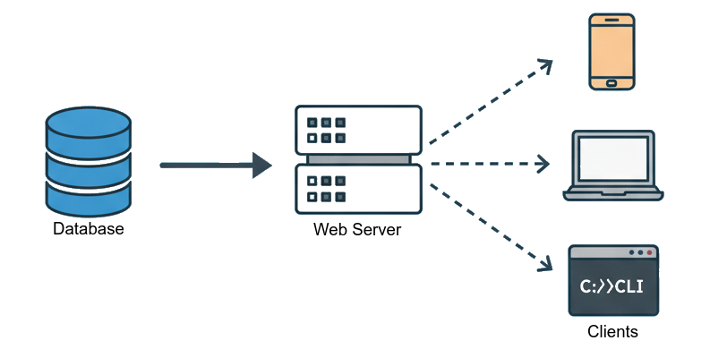
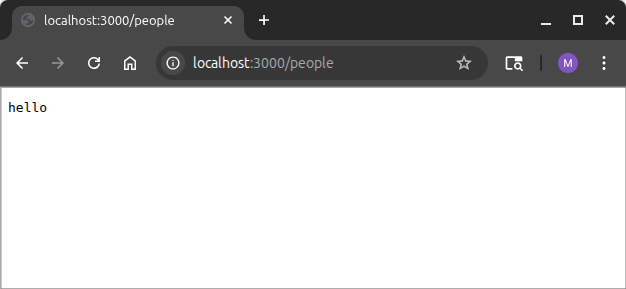
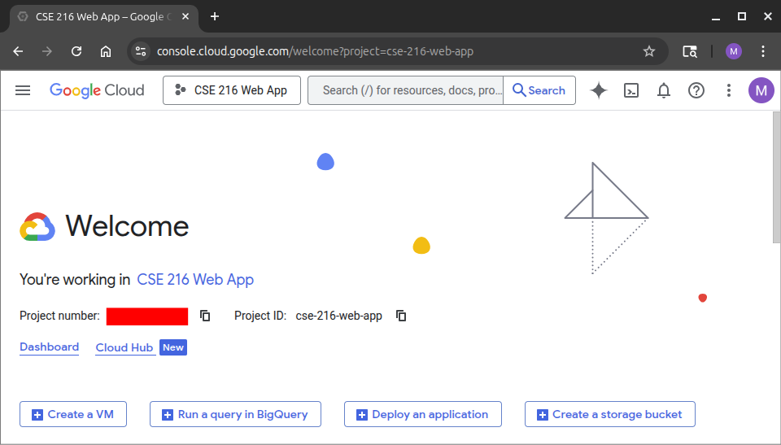
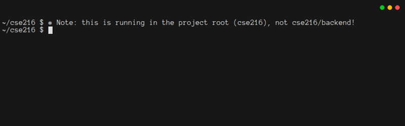
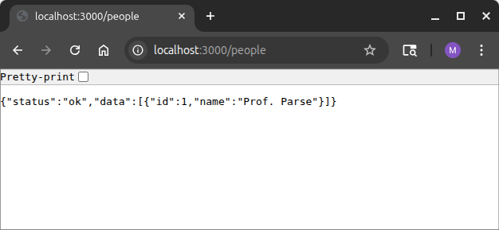

# 2. Web Back-Ends with Javalin

## 2.1. Introduction

Now that you've got some experience writing Java code that interacts with a database, it's time to create a web server that can interact with the same database.
This server will fill the middle position in the [n-tier software architecture](https://en.wikipedia.org/wiki/Multitier_architecture), of your program:



The server's main role is to mediate all interaction between the "clients" (such as web browsers and mobile apps) and the database.
This is going to include authenticating users, issuing queries, formatting data, and sending the static files that represent the actual web site.

There are a few tricky issues to keep in mind.

1. The server should be "stateless".
   Every time a web browser makes a request, it should include all the information the server needs to handle the request.
   As much as possible the server shouldn't "remember" anything about prior interactions with a client.
2. Malicious users could use a hacked web browser, or a tool that knows how to interact with servers without actually being a browser.
   This means the server cannot trust that requests are well-formed and legal.
   It has to do some validation and checking.
3. The server should send data in a format that works with different languages and programs.
   The server will be written in Java.
   The browser will be running JavaScript.
   A good option is to use the [JSON](https://www.json.org/json-en.html) format.
4. The server should follow best practices when defining how clients interact with it.
   A good option is to create a [RESTful](https://en.wikipedia.org/wiki/REST) API.

That might seem like a lot to keep track of.
Don't fear.
As you work through this tutorial, you'll find that these requirements work together nicely, and everything is going to make sense.

:::tip Reminder
At the end of Chapter 1, you should have entered yourself as a user in a SQLite database.
This chapter will use that database, so be sure you know where it is.
:::

## 2.2. A Simple Web Server

[Javalin](https://javalin.io/) is an easy, efficient framework for building web servers.
To begin, navigate to the root of the folder where you're keeping your work, and use Maven to create a new project, as a sibling of your `admin` project.  The package should be `quickstart.backend`, and the folder should be called `backend`:

```bash
mvn archetype:generate \
    -DarchetypeGroupId=org.apache.maven.archetypes \
    -DarchetypeArtifactId=maven-archetype-quickstart \
    -DarchetypeVersion=1.5 \
    -DinteractiveMode=false \
    -DartifactId=backend \
    -DgroupId=quickstart.backend \
    -Dpackage=quickstart.backend
```

As in Chapter 1, you'll need to edit `pom.xml`.
This time, you'll need to add a dependency to the [Javalin Library](https://mvnrepository.com/artifact/io.javalin/javalin).
It's worth adding a few other libraries now, so also pull in the libraries for Gson (which converts between Java objects and JSON), SLF4J (a simple logging framework), and SQLite.
Add the highlighted lines from the code block below to `<dependencies>` (not `<dependencyManagement>`):

<<< @/02_javalin/backend_01/pom.xml#deps{1-20}

You should also set up the plugin for making an executable jar file, by adding the highlighted lines to the `<build>` section (not `<pluginManagement>`):

<<< @/02_javalin/backend_01/pom.xml#jar{1-25}

Finally, edit `App.java` so it runs a basic web server:

<<< @/02_javalin/backend_01/src/main/java/quickstart/backend/App.java

You'll notice that this code gets its configuration from the environment.
That's no different from the admin app you wrote in Chapter 1.
But now the code is a bit more explicit about printing out its configuration.
This is a surprisingly nuanced issue.
Logging can add run-time overhead to your program, so there's an incentive to skip logging.
But once you stop running your server from your computer, and start running it from a world-accessible server, it's going to become tricky to debug your program.
At that point, logging can help **a lot**.
So for now, while you're still getting everything to work, you should do lots of logging.
If you determine that the overhead of logging becomes burdensome, you can always *introduce an environment variable that controls the log level*.

Right now there is only one environment variable, the port.
Your computer has an IP address, such as 128.180.1.81.
A computer can run many services, so many machines might try to contact the same address, for different purposes.
Associating each service with a different port makes this whole process work.
Some ports are standard, like 80 for unencrypted web traffic and 443 for encrypted web traffic.
In this chapter, the only requirement is that you choose a port that isn't already in use on your computer.
3000, 5000, and 8000 are common choices.

Finally, you'll see that there are three steps to use Javalin.

1. You `create` an app.
   Right now, your app doesn't take any configuration information.
2. You configure the different resources that the app provides, and how it provides them.
   For now, there is just one resource, the root resource (`/`).
3. You call `app.start(port)` so your app will start responding to requests

In the code for handling requests for the root resource, you might be confused by the `->` syntax.
This is known as a [lambda expression](https://docs.oracle.com/javase/tutorial/java/javaOO/lambdaexpressions.html).
Almost every major programming language has lambdas.

In the [Handlers](https://javalin.io/documentation#handlers) section of the Javalin documentation, you'll see that this syntax is common in Javalin.
The main idea is that you can write a function on the fly and pass it to Javalin.
Javalin will run that function when it needs to (e.g., in response to a `GET` request).
You can read the code like this:

```java
// in response to a GET request for '/', run a function that takes a single
// argument called `ctx`, of type `Context`
app.get("/", ctx -> {
    // This is inside the function to run.  It modifies ctx by setting the HTTP
    // status code and HTTP content type for the response
    ctx.status(200);
    ctx.contentType(ContentType.TEXT_PLAIN);
    // ctx.result() sets some text that makes up the response to send back to
    // the machine that made the request
    ctx.result("hello");
}); // '}' ended the function, and ')' ended the call to app.get().
```

So then `app.get("/", ctx -> { /* ... */ })` is really saying "when there is a request for the root document, run the function between the `{}` braces, and pass in `ctx` as an argument to it."
What makes lambdas so powerful is that they *capture* their local context.
That is, your lambda can access some of the local variables that are defined in enclosing scopes.
You'll see this ability very soon.

Notice that the call to `app.start()` returns, so `main()` will also return.
Javalin is a *multithreaded* server, and it keeps running.
To see this in action, type `mvn package`, and then `PORT=3000 java -jar target/backend-1.0.jar`.
You'll see that the app doesn't return.
To stop it, you'll need to press `ctrl-c`.


If you point your web browser at <http://localhost:3000>, you should see something like this:



Of course, if you try other addresses, like <http://localhost:3000/people>, you should see an error, because you haven't set up a route for that yet.

Remember: you'll need to press `ctrl-c` from the terminal to stop your web server in order to re-build it after you edit code.

## 2.3. REST Routes

REST is a design philosophy for creating web services, in which the server does not keep track of the state of the application.
With REST, developers think of the server as maintaining a directory-like structure for all of the resources it manages:

- To perform an action on a resource, a client sends the server a message that includes the resource name, a "verb" describing the action to perform, and some optional additional information
- The server then replies with a result

REST-based designs decouple the server from the various front ends of your program.
A mobile app, web site, and command-line tool can all use the same REST API to request service.
Put another way, REST discourages programmers from coupling the interface with the server.
This makes maintenance, testing, and upgrading much easier.

REST is also good for "scale out".
Since the server is *stateless*, REST designs make it easy to start a few more servers when demand is high.
Clients can seamlessly send requests to one server, or another, without there appearing to be any interruption in service.

REST works because the HTTP protocol supports several verbs.
Most notably, REST maps the `post`, `get`, `put`, and `delete` verbs of the [HTTP Protocol](https://en.wikipedia.org/wiki/HTTP) to `create`, `read`, `update`, and `delete` operations (CRUD).
As you saw in Chapter 1, these correspond to the SQL commands `INSERT`, `SELECT`, `UPDATE`, and `DELETE`.
The app you make in this chapter will use these four verbs.[^REST]
Any request to read a resource, whether a web page or a computed value, uses `get`.
And any program that can speak the HTTP language can issue `get`, `post`, `put`, and `delete` commands.

[^REST]:
    The following rules are good to keep in mind when writing REST servers.

    - `GET`
      - Appropriate for reading resources
      - Can return one item or many
      - May return the entire resource, or just part of it
      - Typically does not include extra parameters, except perhaps for a small [Query String](https://en.wikipedia.org/wiki/Query_string)
      - Examples:
        - `GET /message` would typically get all resources associated with `abc`
        - `GET /message/2` would get the resource associated with `abc` that has the unique identifier `2`
        - `GET /message?format=json;color=false` uses a query string to provide two extra arguments
          - Note that arguments are application-defined
    - `POST`
      - Appropriate for creating resources
      - Typically only creates one resource at a time
      - Typically uses the same resource name as the one used to `GET` all
      - Usually returns the unique identifier it makes
      - Non-idempotent: Multiple sequential POSTs typically will create a new resource every time.
      - Data is provided via the "request body"
      - Examples:
        - `POST /messages` is the common form
    - `PUT`
      - Appropriate for updating an existing resource
      - Idempotence: Repeating PUTs on an existing resource has the same effect as calling it once
      - In pure REST designs, `POST` overwrites the entire resource
      - Use with care, because another client might have done a `PUT` between your `GET` and `PUT`
      - Data is provided via the "request body"
      - Example:
        - `PUT /messages/2` is the common form
    - `DELETE`
        - Appropriate for removing a resource
        - Typically deletes one resource at a time
        - Typically does not include extra parameters
        - Example:
          - `DELETE /messages/2`

In order to really see how everything is working, you should modify the way that you create your server, so that it does some more verbose logging.
The code below configures the server to print the `scheme`, `name`, `path`, and `fullUrl` on any request.
If there is a query string or request body, that will be printed, too.
This is almost certainly too much logging for a production service.
In particular, it risks putting secure information into the logs.
You'll want to turn this off eventually, but for now it will make debugging a lot easier.

<<< @/02_javalin/backend_02/src/main/java/quickstart/backend/App.java#create

If you re-compile and re-start your server, and then visit <http://localhost:3000>, you should see a log message in your terminal.
You should also see log messages when there are requests for non-existent resources, like <http://localhost:3000/phony.file>


It is even more informative if you use the `curl` program to interact with your web server.
`curl` lets you use `get`, `post`, `put`, and `delete` verbs, and supports query strings and request bodies.
Even when you make requests for things that don't exist, they will show up in the logs.

You can see this in action, by using the `curl` program to interact with your web server.
Try issuing each of the following six commands in another terminal (you may need to use `curl -i` to see more detailed response information):

```text
curl http://localhost:3000/people
curl http://localhost:3000/people -X POST -d "{'name':'PROF. Parse'}"
curl http://localhost:3000/people/1 -X PUT -d "{'name':'Prof. Parse'}"
curl http://localhost:3000/people/1 -X DELETE
curl http://localhost:3000/people?key=value
curl "http://localhost:3000/people?format=json&colorize=true"
```

Your Javalin logs should show something like this:


:::tip Note: HTTP Status Codes
HTTP uses status codes to indicate whether a verb succeeded or failed in its attempt to operate on a resource.
For now, you'll see the error codes (if `curl` is not showing them to you, consider use of `-i` option).
Eventually, the backend will switch to using use `200 (OK)` almost all the time, and provide error details as part of the response.
:::

You should stop and think for a moment about what just happened.
You interacted with a web server **without using a web browser**.
That also means you interacted with your backend **without having a frontend**.
While developing, this is great, because it means you can build and test your backend independently from the frontend.
But it also means that at any time, a malicious user could use `curl` (or any other program that can communicate via HTTP) to interact with your server.
You will need to make sure that doing so doesn't break your program's security guarantees.

## 2.4. Your First Data Route

It's time to modify the server so that it can interact with the database in response to a GET request.
This is going to end up being the foundation for quite a bit of code, so it's important to organize things carefully right from the start.

You'll need some code for interacting with a SQLite database.
It **would *not*** be a good idea to use the `Database.java` file from Chapter 1, because it has code for creating and dropping tables, and for modifying `tblPerson`.
That code should not be in the backend.
So instead, you should make a new `Database.java` file:

<<< @/02_javalin/backend_02/src/main/java/quickstart/backend/Database.java

The next step is to write the handler for a GET request.
That code will call `getAllPerson`.
You could put the code directly in `App.java`, but in the long run, that will lead to `App.java` being a huge and un-testable mess.
Instead, make a file called `Routes.java`:

<<< @/02_javalin/backend_02/src/main/java/quickstart/backend/Routes.java

The code above might seem like magic.
Somehow, `Gson` knows how to turn your objects into text that can be given to `ctx.result()`.
Under the hood, it's using a technique known as [reflection](https://en.wikipedia.org/wiki/Reflective_programming) to analyze the `records` while the program is running, figure out the field names, and make the text, in a standard format known as JSON.[^about_json]

[^about_json]:
    JSON represents data in a way that looks exactly like a literal term in JavaScript.
    For example, here is a simple object that we might use as the response from a POST:

    ```json
    {
        "result" : "ok",
        "id"     : 101        
    }
    ```

    Every major programming language has easy libraries (or built-in support) for creating and reading JSON.
    JSON is not the most efficient way to communicate binary data, but for this tutorial, it's a good choice.

    JSON also supports arrays:

    ```json
    [0, 1, 2, 3, 4]
    ```

    Of course, arrays and objects can be nested inside each other too.
    The only requirement is that there is exactly one top-level array or object.
    The data can even be heterogeneous.
    Here's an example:

    ```json
    [
        1, 
        [ 2, 3, 4 ], 
        {  "num": 5 },
        6,
        [ 7, [ 8, 9, 10 ], 11, {  "num": 5, "vals": [1, "a", 3] } ],
        13
    ]
    ```

Now you can rewrite `App.java` to make use of the `Routes` and `Database` classes.
Start by adding a few imports:

<<< @/02_javalin/backend_03/src/main/java/quickstart/backend/App.java#import

Then start accepting a second environment variable, for database configuration.
This requires two changes.
You can get the environment variable like this:

<<< @/02_javalin/backend_03/src/main/java/quickstart/backend/App.java#envars1{2}

Then you can print it to the log like this:

<<< @/02_javalin/backend_03/src/main/java/quickstart/backend/App.java#envars2{2}

It is a good idea to set up your database before calling `Javalin.create()`, because you want it to be fully configured before the app starts listening for requests.
At the same time, you can make the global `Gson` instance that your routes will use to turn objects into JSON text.

<<< @/02_javalin/backend_03/src/main/java/quickstart/backend/App.java#dbconfig

Finally, remove the `get` route for `"/"`, and then add a new routing section:

<<< @/02_javalin/backend_03/src/main/java/quickstart/backend/App.java#routes

At this point, your server should be able to run.
Before testing it, it would be good to add one more feature.
You probably noticed that in Chapter 1, the `Database` was `AutoCloseable`, but for the backend, it isn't.
That's necessary, because the server keeps running after `main` returns.
It would still be nice to clean up the database properly.
To do that, you can set up some code to run when `ctrl-c` is pressed.
This should go right before `app.start()`:

<<< @/02_javalin/backend_03/src/main/java/quickstart/backend/App.java#shutdown

It's time to test the code.
If your server is still running, press `ctrl-c`.
Then re-compile with `mvn package`, and then run the new version of your code with a command like `PORT=3000 DB_FILE=../db.db java -jar target/backend-1.0.jar` (make sure to use the path to your database from the previous tutorial step)!

Using another terminal window, try using `curl` to get the `/people` route:


## 2.5. Setting Up Google OAuth

The previous step was pretty amazing.
The web server accessed the database to get a list of all the users, and it sent that list back to the client as a JSON object.
But there's something scary here, too.
Anyone with internet access can get that list.
If you were to make it possible to change a display name, or do CRUD operations on messages, then how could you ensure that only authorized users can access the system?

There are actually two parts to this problem.
One is the need to limit system access, so only authorized users can do anything.
The other is the need to be careful in the application logic (`Routes.java`), so that authorized users only access data they are supposed to access.

The first step toward solving this problem is to provide a way for people to log in.
But how?
**Managing passwords for users is a bad idea**.
It is a sure-fire way to become complicit in some security breach.
Instead, you should *delegate* authentication to a trusted third party.
This tutorial relies on Google.

In more detail, Google is one of many companies that supports [OAuth 2.0 Authentication](https://oauth.net/2/).
There are many different ways that OAuth can be implemented.
In this app, it's going to work like this:

1. On any access, the server will check if the user has successfully logged in.
2. If not, the server will redirect to a special page at Google, and pass a special token along with the redirect.
3. Upon authenticating with Google (probably using a username and password, plus some kind of two-factor phone-based authentication), the user will be redirected back to your website (at a special route you set up for this).
4. The web server will work with Google to finish the log-in operation.

In order to get this to work, the first step is to visit the [Google Cloud Console](https://console.cloud.google.com/cloud-resource-manager) and set up a new project.
Click on "Create Project" and give your project a name like "CSE 216 Tutorial Web App".
It is best if you use your "@lehigh.edu" account, so that you can use "lehigh.edu" as your Organization and Location.
When done, click "Create".

Now, if you click on "Google Cloud" in the top left, you should be redirected to a page like this:



From the hamburger menu in the top left, choose "APIs and Services/Enabled APIs and services", then search for the "People" API and enable it.
Then click "Credentials" on the left sidebar.
Choose "Create Credentials" and then "OAuth Client Id".
Start following the prompts, making sure to pick an "External" audience for now.
Then click "Create OAuth client" and choose "Web application".
Add an origin of `http://localhost:3000` and a redirect URI of `http://localhost:3000/auth/google/callback`.

:::warning Warning
You need to be very careful about this next step!
:::

You will be instructed to securely record your Client Id and Client Secret.
If you lose this information, you can't get it back, and you will need to generate a new OAuth client.
But these are supposed to be secrets.
You definitely do **not** want to check them into your repository.
For the time being, save them into a file on your desktop.

The secrets will need to be transmitted to your Javalin program through environment variables.
That being the case, a common approach is to have a special `.env` file that contains *all* of your environment configuration.
A best practice is to make a folder that is *not* checked into your repository, and keep your `.env` files in it.
In this way, the secrets will be conveniently located for running unit tests, but not uploaded to any server.

To set this up, from the root of your repository, type the following commands:

```bash
mkdir local
echo local/ >> .gitignore
echo '*.env' >> .gitignore
touch local/backend.env
```

To ensure that you've done this correctly, type `git status`.
You should see that your `.gitignore` has been modified, but your `backend.env` file should not appear in the listing.



Next, add your configuration to `local/backend.env`.
Instead of `xxx`, be sure to include your secrets.
Also, notice that there als now a `SERVER_NAME` variable.
Google OAuth will need this:

```bash
# MAKE SURE THIS .env FILE IS **NEVER** CHECKED INTO THE REPOSITORY
export PORT='3000'
export DB_FILE='../db.db'
export CLIENT_ID='xxxxxxxxxxxx-xxxxxxxxxxxxxxxxxxxxxxxxxxxxxxxx.apps.googleusercontent.com'
export CLIENT_SECRET='XXXXXX-XXXXXXXXXXXXXXXXXXXXXXXXXXXX'
export SERVER_NAME='http://localhost'
```

With this in place, you can run `source ../local/backend.env` from the `backend` folder, and any program you run *from the current shell instance* will have access to your configuration.
That is, instead of typing things like this:

```bash
PORT=3000 DB_FILE=../db.db java -jar target/backend-1.0.jar
```

Now you'll type things like this:

```bash
source ../local/backend.env
java -jar target/backend-1.0.jar
```

## 2.6. Managing Logged-In Users With A Stateful Session Store

When a user logs in, they shouldn't need to keep on re-entering their login credentials.
They should stay logged in for a while.
But how long?
And can they be logged in on several devices at the same time?

This is an important security decision.
It also affects some deep aspects of how you will write the code.
If you want a user to be able to stay logged in on several machines at once, you might want to consider using Javalin's built-in "session" feature.
But if you want a user to be able to log out of all devices by logging in to a new device, Javalin's "session" is not going to work.
Also, if you are eventually going to "scale out" and have many servers to satisfy all your clients, then using the built-in "session" feature will prove tricky.

This tutorial uses a hash table to store all session information.
This fits the "one device at a time" strategy.
It also works nicely with scale out, because you could easily replace the hash table with a [Memory Cache](https://memcached.org/).
The session hash table requires some cryptographic features, and the interaction with Google requires some other features.
To get all of that, update your `pom.xml` file with the highlighted dependencies:

<<< @/02_javalin/backend_04/pom.xml#newdeps{1-20}

:::warning Warning: Stay Up To Date!
You should regularly check the [Maven Repository](https://mvnrepository.com/) to ensure you've got the latest versions of any libraries in your `pom.xml` file.
:::

Next, you will need to add some code to `Database.java`.
This code checks the database when a user logs in, and rejects anyone who doesn't have a registered email:

<<< @/02_javalin/backend_04/src/main/java/quickstart/backend/Database.java#login

Now it's time to create `Sessions.java`.
This is where the server will store information about logged-in users.

<<< @/02_javalin/backend_04/src/main/java/quickstart/backend/Sessions.java

You should make sure you understand this code, since it's the backbone of your app's security.
The `RandStringCreator` uses a cryptographically secure pseudorandom number generator to create a random sequence of characters, which serves as a user's "secret".
The `Sessions` object maps a user's Google Id to a secret (and also some other information).
The secret gets made, and added to `Sessions`, on a successful login.
If every subsequent interaction with the server includes the user's Google Id and the secret, then the server can prove that a user is valid by observing that the Google Id maps to the secret in the `Sessions` object.
Logging out simply removes the mapping from `Sessions`.

## 2.7. Interacting With Google OAuth From Javalin

It turns out that the code for interacting with Google from Javalin requires some significant configuration.
The code for getting the environment variables should go in `App.java`.
The rest of the Google OAuth configuration will go in a new `GoogleOAuth.java` file.
When it comes to the actual routes, those will go in `Routes.java`.

Since the `CLIENT_ID` and `CLIENT_SECRET` are in an environment variables, you should add these lines to `App.java` right after the line for getting `DB_FILE` from the environment.
Note that you'll also need the name of the server, in order for Google OAuth to work nicely.

<<< @/02_javalin/backend_04/src/main/java/quickstart/backend/App.java#new_env

In the subsequent debug code that prints environment variable configuration, you might want to display these lines.
Remember that printing secrets to the log is probably a bad idea!

<<< @/02_javalin/backend_04/src/main/java/quickstart/backend/App.java#print_env

Of course, any time you get environment variables, you should check them.
Doing so will require you to *change* the lines that do the check:

<<< @/02_javalin/backend_04/src/main/java/quickstart/backend/App.java#validation

Next, start writing `GoogleOAuth.java` by adding some imports:

<<< @/02_javalin/backend_04/src/main/java/quickstart/backend/GoogleOAuth.java#newdeps

You're going to need to set up quite a few objects in `GoogleOAuth.java` in order for Google OAuth to be usable.
It's probably not important that you understand this code yet.
But you need *all of it*.

<<< @/02_javalin/backend_04/src/main/java/quickstart/backend/GoogleOAuth.java#setupOauth

Because you will need the routes used for authentication in a couple places, you should define them as constants in `Routes.java`:

<<< @/02_javalin/backend_04/src/main/java/quickstart/backend/Routes.java#constants

And now in `App.java` you can create the `Sessions` object and the `GoogleOauth` object.
It doesn't matter too much where you put this code, as long as it comes before the code that you're about to write.
After the call to `Javalin.create()` is a good location.

<<< @/02_javalin/backend_04/src/main/java/quickstart/backend/App.java#sessions

Next comes the part of the code that actually enforces authentication.
Javalin supports `before` handlers, which run before any `get`/`post`/`put`/`delete` is serviced.
In this case, the `before` code extracts the user's Google Id and secret from cookies sent by the browser.
These cookies will be sent on every request from the browser, so they're always available to check.
It uses them to check `sessions`.
On a match, the request continues.
Otherwise, it redirects to the Google address for logging in.
Note that there's also a special case for when Google redirects *back*.
In that case, you need to let the request fall through to some code that you'll add next.

<<< @/02_javalin/backend_04/src/main/java/quickstart/backend/App.java#before

The last change to `App.java` is to set up routing for logging in and logging out.
When a user logs in, Google will redirect the browser to `SERVER_NAME:PORT/auth/google/callback`.
To log out, the user will try to read `/logout`.
These routes can go immediately before the route for getting `/people`:

<<< @/02_javalin/backend_04/src/main/java/quickstart/backend/App.java#new_routes

Finally, it's time to update `Routes.java`.
You should add two new routes.
The route for `authCallback` is tricky.
It needs to extract a message that Google embedded in the query string, and then send that back to Google to finish the authentication.
If it works, then this code queries Google *again*, to get the user's email address and name.
Then it makes sure the user is allowed (in the database).
If anything fails, redirecting to the fake `/autherror` route will re-start the login process.
If everything works, then the server will make a secret for the user, and attach it to the context as a cookie.
The cookie will be sent back to the user as part of the response, and then the user's browser will send it on every subsequent request.

Compared to that, the code for logging out is simple: it just drops the user's info from the `session` table.

<<< @/02_javalin/backend_04/src/main/java/quickstart/backend/Routes.java#new_routes

As is so often the case, this code won't work unless you add a few imports.
If you're using your IDE well, it probably added these for you when you entered the code for the routes, but just in case it didn't, here they are:

<<< @/02_javalin/backend_04/src/main/java/quickstart/backend/Routes.java#newdeps

:::warning Warning: Cookie Security
It's important to reiterate a that if a bad actor can learn a user's `gId` (which is not secret) and `key` (which is), they can impersonate the user.
You will learn how to do that impersonation in just a moment.
Keeping cookies secure is a responsibility that all users ought to take very seriously.
:::

## 2.8. Testing OAuth

:::warning Reminder
Your `CLIENT_SECRET` should **never** appear *anywhere* in your git repository (e.g. as a constant in a `.java` file).
:::

With your `local/backend.env` file in place, you can start your server like this:

```bash
cd ~/cse216/backend
mvn package
source ../local/backend.env
java -jar target/backend-1.0.jar
```

If you run `mvn package` and then re-start your backend, it should look something like this:


To stop your server, press `ctrl-c`.

It's possible to test your server right now, by following these instructions:

1. Make sure your backend is running
2. In your browser, go to <http://localhost:3000>
3. You will be automatically redirected to Google to authenticate
4. Log in, making sure to use the email address that you set up at the end of Chapter 1
5. Google will redirect to `/`, where you should see the error message `Endpoint GET / not found`.
   That's expected, because you *deleted* the route for `/`.
6. Change the address to <http://localhost:3000/people>.
   You should not be asked to log in again, and you should see something like this:



Now it's time to explore how cookies work.
Open the "developer console" in your web browser (pressing F12 usually does this in Chrome and Firefox) and type `document.cookie`.
You should see something like this.
Note that the order of key-value pairs is not important, and some of your values will be different:

```text
'auth.gId=111044916034782695562; auth.email=mfs409@lehigh.edu; auth.name=TWljaGFlbCBTcGVhcg==; auth.id=1; auth.key=MubUx0dYdU6ahZV5u2hNx'
```

If you try to access your backend by typing `curl http://localhost:3000/people`, you'll get the response `Redirected`.
You've locked out anyone who isn't logged in!
Try it again, this time with verbose output: `curl --verbose http://localhost:3000/people`.
Among other things, you'll see that your `CLIENT_ID` is definitely not being kept secret!
Finally, try running curl but providing the cookies via the `-b` flag.
This should successfully get the data from the server, as if `curl` had done an OAuth-based login:


At this point, you should look through the code, and figure out which cookies are essential for authentication.
Try changing one cookie or another in the `curl` command, until you know which matter the most.
Note that the "non-essential" cookies will still be important for the user experience in your frontend.

## 2.9. Protecting Data From Authorized Users

Now it's time to implement some access controls within the application itself.
Broadly, this step relates to [IAM](https://en.wikipedia.org/wiki/Identity_and_access_management).
The key idea here is that it's not enough to make sure that the system is only accessible to logged-in users.
You also need to make sure that logged-in users can't do things that are inappropriate.
For example, a user should be able to change their own display name, but they should not be able to change another user's display name.
And as before, you need to remember that you cannot trust the frontend to provide this protection.
A valid user who extracts their cookie from the browser and then uses `curl` must not be able to use the fact that they are *authorized* as a back-door that lets them impersonate another valid user.

The good news is that the objects in `Session` storage do not change.
If a user is logged in, you know it because their `auth.gId` maps to an object whose `key` matches their `auth.key`.
When you first put an object into the session storage, you also set a few other fields that will never change.
Thus at any time, you can use `auth.gId` to do a lookup in `Session`, get back an object, and even if the `auth.id` says otherwise, that object's `id` will be the true id of the user.

To explore this idea of authorization, follow these steps to enable a person to change their name, and to view any person's name.
First, add the names of two new routes to `App.java`.

<<< @/02_javalin/backend_05/src/main/java/quickstart/backend/App.java#manage_names

Next, implement the routes in `Routes.java`.
Notice how predictable this code is, even though you haven't written the database code yet.
By sticking to common patterns, your code will be repetitive, but easy to maintain.

<<< @/02_javalin/backend_05/src/main/java/quickstart/backend/Routes.java#manage_names

Finally, update `Database.java` to create the database operations.
Notice that this code adds a `validate()` method to the record.
The record holds data provided by the user, not by the database, and your code should not trust the frontend.
Thus you'll need to make sure the input is legitimate before you use it.
Wrapping that logic in `validate()` makes it easy to write the code once, and use it any time you need it, without cluttering the `updatePersonName` code.

<<< @/02_javalin/backend_05/src/main/java/quickstart/backend/Database.java#manage_names

At this point, you should stop your server, recompile it (`mvn package`), and then use your script to re-start it (or otherwise set environment variables and launch manually).
On any restart, you'll need to log in again (i.e. get a new `auth.gId`).
Then use `curl` to interact with these routes (changing the argument to `-b` appropriately):


Your ids and values will change based on your login information and prior interactions with your database.
Be sure you do a `GET` on the `/people` route with the `id` that matches the `auth.id` you logged in with (i.e. `curl http://localhost:3000/people/YOUR_ID_HERE`)!

## 2.10. CRUD Operations For Messages

Though it may not seem like it, your server is almost done.
Now that authentication is in place, and you have a way of interacting with the database, all that remains is to wire up a few more routes for performing CRUD operations on `tblMessages`.
The changes you make at this point should feel familiar.
By following a pattern as you add features, it becomes much easier to understand your code, even as the number of lines increases quickly.

To begin add four new `records` and five new methods to `Database.java`.
Two of the records will let your code return versions of a message appropriate for when you want to show the details or just a summary.
The other two will hold input from the client.
Of course, those two will require `validate` methods.
In addition, the `insertMessage` method now passes an extra parameter when constructing the statement.
Then it can use `getGeneratedKeys()` to get the `id` of the row that was created.

<<< @/02_javalin/backend_05/src/main/java/quickstart/backend/Database.java#messages

Note: you might need to add these imports:

<<< @/02_javalin/backend_05/src/main/java/quickstart/backend/Database.java#import

Next, update `Routes.java` with five new methods that perform access management before calling your `Database` methods.
In this code, you'll notice that the user is not providing their `id` from `tblPerson`.
The code is also not accessing `tblPerson` to get that `id`, and it is not trusting the cookie.
Instead, it is using the `Sessions` object to get the id, using the only piece of the cookie that can be trusted: the Google Id (`gId`).

You should also pay attention to how this code works with `Database.java` to handle access management.
Consider updating a message:
First, `Routes.updateMessage` passes the client's `id` to `Database.updateMessage` as the `creatorId`.
Then `Database.updateMessage` uses that `creatorId` in the SQL statement.
If the user tries to update a message they didn't create, the database will produce an error, because there is a mismatch: the row `id` and the `creatorId` must both match.

<<< @/02_javalin/backend_05/src/main/java/quickstart/backend/Routes.java#messages

Finally, add the needed routes to `App.java`.
In these routes, notice how `{id}` serves as a wildcard.
Specifying the parameter in the route like this makes it available in `Routes.java` through `ctx.paramPath("id")`.

<<< @/02_javalin/backend_05/src/main/java/quickstart/backend/App.java#messages

At this point, you should run `mvn package` and then re-start your server.
Then log in through your browser and get your the new cookie.
Once you have it, try to perform malicious deletions and updates using `curl`.
Try changing the `id` in the cookie.
Try sending a `DELETE` for a message that the logged-in user did not create.
In all cases, you should find that your backend prevents the bad behavior, without crashing.

## 2.11. Finishing Up

At this point, it would be a good idea to commit your work to your git repository.
You also should be thinking about how to write unit tests for your routes.
Based on how the code is organized, it shouldn't be too hard to test the database.
To test the routes separately, you'll need to *mock* the database.
In addition, since you know how to provide cookie data to `curl`, it should be possible to test the code in `App.java`, too.

You should take a moment to think about the code in this tutorial.
It has comments at the top of every method, and in any place where the logic isn't obvious.
That's not because it's a tutorial.
You should *always* comment your code well.
Keep in mind that on any real project, new people could join the team at any time.
You want the code to explain itself to them.
In addition, you are probably noticing that the functions are all staying pretty short.
Doing that makes your code easier to extend, and easier to verify with unit tests.

Before moving to the next tutorial, it's useful to reflect on one final point.
You are going to learn how to make a web front-end that looks nice.
When a well-behaved user interacts with that front-end, it should be impossible to send invalid messages to the server.
**But that's not enough security.**
You saw that with `curl`, you could easily send messages to the server *without a front-end*.
The server needed to protect itself, and not merely trust the front-end.
It did not take a lot of code to get this protection, but you needed to think about protecting every route, from `App.java` all the way through to the database.
This was a lot easier since your code followed a pattern: authenticate, transform JSON request to a `record`, validate the record, and then use Java or SQL constraints to ensure the request does not touch data that it should not touch.

Imagine if you hadn't implemented security right away.
How hard would it be to retrofit security after you've added 10 more tables and 50 more routes?
How much code would you need to rewrite?
As you move through these tutorials, please do not forget that security cannot be an afterthought!

## 2.12. Getting Ready For Chapter 3

Before you move on to Chapter 3, you should make sure the code in your `backend` folder matches the code below:

::: code-group
<<< @/02_javalin/backend/pom.xml
<<< @/02_javalin/backend/src/main/java/quickstart/backend/App.java
<<< @/02_javalin/backend/src/main/java/quickstart/backend/GoogleOAuth.java
<<< @/02_javalin/backend/src/main/java/quickstart/backend/Routes.java
<<< @/02_javalin/backend/src/main/java/quickstart/backend/Sessions.java
<<< @/02_javalin/backend/src/main/java/quickstart/backend/Database.java
<<< @/.gitignore
:::

## Footnotes
