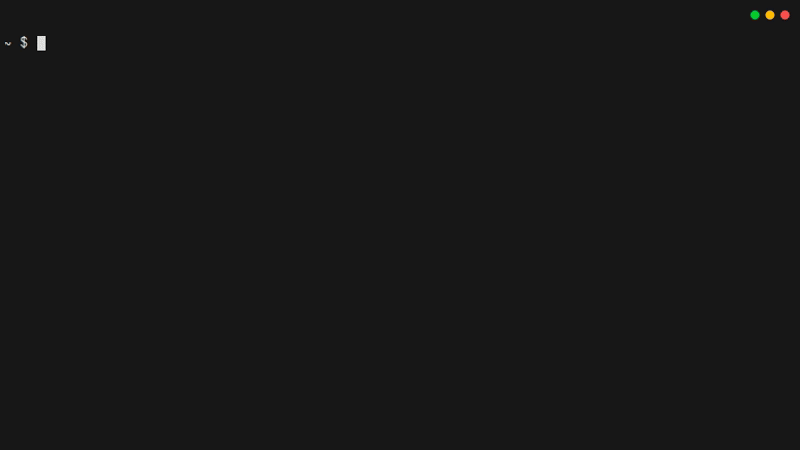
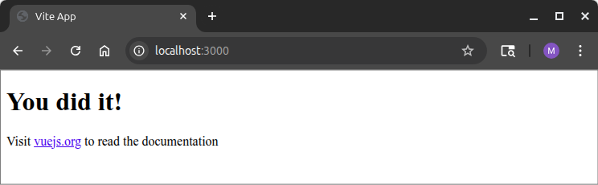
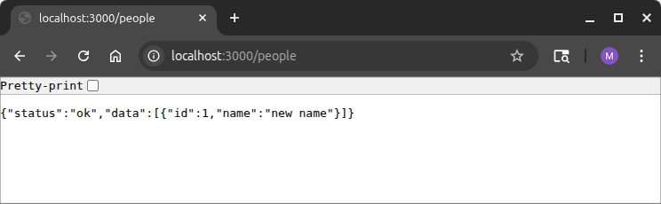
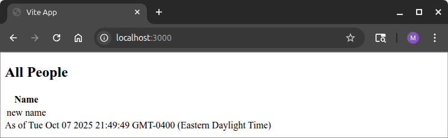
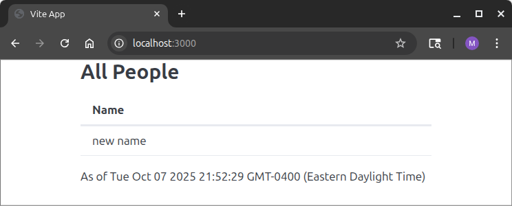
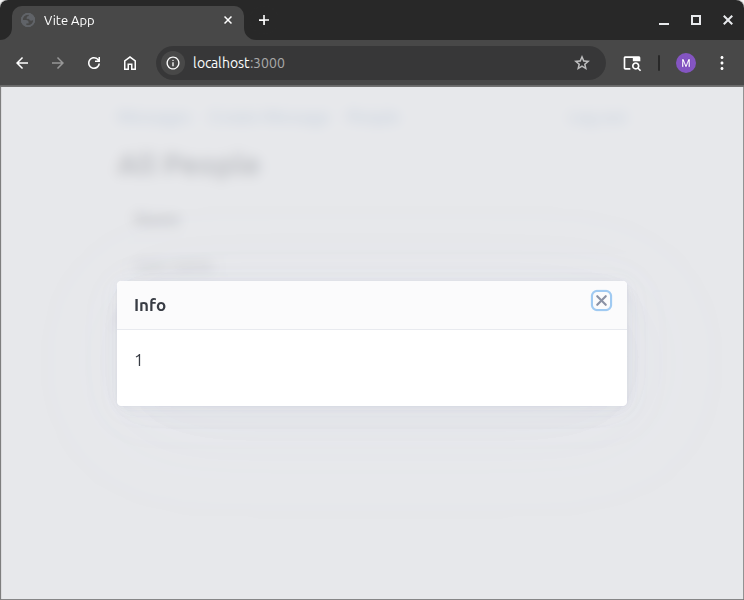

# 3. Web Front-Ends With Vue.js And Pico.css

## 3.1. Introduction

While it would be possible for users to interact with your backend using `curl`, that would not be particularly easy for them.
Instead, you should give them an intuitive web-based interface.
This is known as the application's "front end".
As you make it, keep in mind a few things:

1. The front end should help the user to avoid making mistakes
2. The back end cannot rely on the front end to prevent security violations
3. The front end should be easy to use
4. The front end should be easy to maintain

A key idea in web design is to separate the frontend into three parts:[^html5]

[^html5]:
    Splitting code like this is a core part of [HTML5](https://en.wikipedia.org/wiki/HTML5)

1. Structure of the interface:
   This uses HTML tags to create a template, and then data gets inserted into places in that template.
2. Style of the interface:
   This uses CSS rules to describe how those tags should appear.
3. Reactive code:
   This uses JavaScript to get data, put data into the templates, and react when the various interactive components in the front end are clicked.

For each of these parts, there are many different frameworks and tools that you could use.
You must choose wisely.
Whatever choice you make will affect the long-term maintainability of the program, because a new maintainer who is unfamiliar with your chosen technology will need to learn the tech before they can contribute.

Fortunately, there are synergies between some choices.
In particular, there is an approach to structuring the interface based on [Semantic HTML](https://en.wikipedia.org/wiki/Semantic_HTML).
Semantic HTML uses special tag names to indicate their meaning or their role in the user interface.
A simple example is that a table whose first row has column headings could use `<th>` tags (table header) instead of `<td>` tags (table data).
There are some very specific semantic tags, like `<dialog>` and `<nav>`, and some more generic ones, like `<article>`, `<header>`, `<section>`, and `<main>`.
These are leveraged by the [Pico](https://picocss.com/) css framework to deliver a default style that lets you avoid writing much style style code, while still getting a nice-looking interface.

This chapter will show you how to use the [Vue.js](https://vuejs.org/) framework to manage the reactive code.
Vue will handle a lot of tricky tasks without requiring you to write much code.
Vue is compatible with [TypeScript](https://www.typescriptlang.org/), an alternative to JavaScript that helps you find bugs early.

## 3.2. Updating The Back-End To Serve Files

The back-end server will need a place where it can find your frontend's `.html`, `.js`, and `.css` files, so that it can send those files to a client browser to enable the browser to present the user with a nice interface.
When your app is live on the web, those files should be *inside the jar* that gets produced by `mvn package`.
But you do *not* want to have to re-compile and re-start the backend every time you make a tiny change to the frontend.
A nice approach is to use an environment variable to decide, at run time, whether to use the jar, or to use a special out-of-jar mechanism.

In your backend's `App.java` file, first add this import:

<<< @/03_vue/backend_01/src/main/java/quickstart/backend/App.java#import

Next, get the `STATIC_LOCATION` environment variable:

<<< @/03_vue/backend_01/src/main/java/quickstart/backend/App.java#get_env

Don't forget to report it in the log, to help with debugging:

<<< @/03_vue/backend_01/src/main/java/quickstart/backend/App.java#report_env

Finally, in the lambda where you configure Javalin, after you finish attaching the logger, add these lines:

<<< @/03_vue/backend_01/src/main/java/quickstart/backend/App.java#config

This code does two things.
First, it uses `config.staticFiles` to say that whenever a `GET` request cannot be satisfied by one of the data routes that you will set up below, the server should try to find a file that can do the job.
If the `STATIC_LOCATION` environment variable is set, it should try to find a matching file path/name in the given folder.
Otherwise, it should look in the `jar` file.
To get files into the jar, you'll need to put them in the `/src/main/resources/public` folder.

Secondly, it uses `spaRoot` to indicate that when a matching static file cannot be found, you still want to send the main web page, instead of producing a 404 error.
This provides a nicer user experience, because it means that the frontend can be a [single page app](https://en.wikipedia.org/wiki/Single-page_application) that lets the user refresh at any point and not lose their navigation history.
Notice that the `spaRoot` path varies depending on whether the file is served from the filesystem or the jar.

Before moving on, you should run `mvn package` to make sure there aren't any syntax errors.
You won't be touching this Java code again for a while.

## 3.3. Creating A Vue Project

It's time to make the default Vue.js project.
To do this, you will need to install [Node.js](https://nodejs.org/en).
Then, in the root of your project (the folder where `admin`, `backend`, and `local` are sub-folders), type the following:

```bash
npm create vue@latest
```

You will need to answer a few questions:

- Be sure to say `y` when asked "Ok to proceed?"
- For the project name, type `frontend`.
- For the features, use the up and down arrows, along with the space bar, to select `TypeScript`, `Router`, `Pinia`, `Vitest`, and `ESLint`, then press `Enter`
- You don't need experimental features, so you can just press `Enter`
- Say `y` when asked about skipping example code

This will produce a folder structure with 22 files in it.
The most important is `package.json`.
It is like `pom.xml` in your Java projects.
However, `npm` and `mvn` work a bit differently.
Whereas maven would automatically fetch libraries any time the `pom.xml` file changed, `npm` requires you to explicitly fetch libraries any time `package.json` changes.
This includes the very first time, so you should immediately type `cd frontend` and then `npm install` to fetch the dependencies for your program.



Next, you should add some additional libraries.
This is a little bit easier than what you did with Maven, because you don't have to find XML on the web: you can just ask `npm` to get the latest versions for you:

This line will add the libraries that are used by the frontend:

```bash
npm install @picocss/pico
```

This will add add libraries that will be useful when building the code.  Since they won't be part of the app, just part of the build process, you should use the `--save-dev` flag:

```bash
npm install --save-dev rimraf copy-folder-util
```

:::tip Regular vs Dev Dependencies
Regular dependencies are for libraries that must be included as part of the app that you publish to the web.
Dev dependencies are for tools that you need in order to build the app, but that don't ship with the final code.
Examples of dev dependencies include the TypeScript-to-JavaScript compiler and the Vitest unit testing suite.
:::

Finally, add two more lines to the `scripts` section of `package.json`:

```json
    "deploy": "copy-folder-util dist ../backend/src/main/resources/public",
    "clean": "rimraf dist/",
```

:::warning Warning: Commas Matter
`package.json` is *very picky* about commas.
Any time you have a comma-separated list of values inside of `[]` or `{}` braces, the last element *must not* have a comma after it.
:::

With these changes in place, you can type `npm run build` at any time to compile your frontend code to JavaScript, placing it in the `dist` folder.
You can also type `npm run deploy` to copy the most recently built version of your frontend over to the backend's `resources` folder, and you can type `npm run clean` to delete your `dist` folder.

It's time to run your frontend.
First, type `npm run build`.
Then go to your backend folder, and start your web server.
When you start it, be sure to include `STATIC_LOCATION=../frontend/dist` in the environment.
For now, you might want to add this to your `local/backend.env` file, even though you'll need to remove it later.

If you visit <localhost:3000>, you'll be asked to log in.
After you log in, you should see something like this:



If you go to <localhost:3000/people>, you should receive some JSON data, indicating that the data routes behave the same way as before:



And if you go to <localhost:3000/invalid> -- or any other undefined endpoint -- you should see the home page.

You should make sure you understand what just happened.
When you enter an address into the browser, it issues a `GET` to the server.
When the path of the `GET` matches one of your back-end data routes (via `app.get()`), then the corresponding code on the backend figures out how to reply.
If none of those match, then if the path matches the name of a file in the static file path, then that file will be sent.
And if nothing else matches, the `spaRoot` file will be sent instead of the typical behavior of a [`404 Not Found`](https://developer.mozilla.org/en-US/docs/Web/HTTP/Reference/Status/404).

## 3.4. A First Component

A good way to start learning Vue.js is to make a component that can display the list of people more nicely.
In the `src` folder, create a new file named `PersonAll.vue`.  
This component will need `<style>`, `<script>`, and `<template>` sections.
The order of the sections does not matter.
Here's the script:

<<< @/03_vue/frontend_02/src/PersonAll.vue#script

:::tip Use Your IDE Well!
If you are using Visual Studio Code as your IDE, then the first time you open a `.vue` file, it may ask if you wish to install the recommended 'Vue (Official)' extension.
Usually, these extensions do a lot of behind-the-scenes work to help you avoid silly bugs, and to help you write code faster.
However, you should always check the author and reviews before installing an extension.
:::

In this code, there is a `reactive` object called `localState`.
`localState` has two fields, one of which is an array of objects with `id` and `name` fields.
Being `reactive` is important.
That means that when the data in it changes, the UI will automatically change.
It also means that if the data is changed *by the UI*, then the corresponding part of `localState` will change.

There's a `click` function that displays its argument, and then the last piece is a function that issues a `GET` to the server to get the list of people as JSON.
If anything goes wrong, the code reports an error.
Otherwise, it puts the data into `localState`.

Next, add the HTML template for displaying this data:

<<< @/03_vue/frontend_02/src/PersonAll.vue#template

The template uses a `<section>` to hold the component, which consists of a title (in a `<h2>` tag) and a table.
The table uses `v-for` to say "make a table row (`<tr>`) for each row of data in `localState.data`".
Each of those rows needs a unique *key*, and the `id` of the row from the database will suffice.
Lastly, `@click` connects a click of a row to the `click` function from the script.
When it is called, the `id` of the row will be the argument.

Inside the row, there is only one column (a `<td>`).
The double-curly syntax says to use reactive data &mdash; in this case, the value of the `name` field for the row.

Finally, the same double-curly syntax lets the component display the date/time when the data was fetched.

In order to get the component to display, you'll need to update `App.vue`.
You can replace the file with this:

<<< @/03_vue/frontend_02/src/App.vue#template

If you run `npm run build`, and then refresh the page, you'll see that there is now some data going into the template.
But it looks ugly:



You can fix most of the appearance issues by just turning on pico.css.
Simply add this line to `main.ts`:

<<< @/03_vue/frontend_02/src/main.ts#import

Re-run `npm run build`, and then refresh the browser:



That's quite a bit better, but there's one oddity.
Try clicking on a row.
When you do, the `click` function is running, but the row isn't responding to your mouse hovering over it.
To fix that, add this `<style>` section to `PersonAll.vue`:

<<< @/03_vue/frontend_02/src/PersonAll.vue#style

Now when you hover over a row, that row will be highlighted, and the cursor will change.

## 3.5. Getting Started With Routing

Believe it or not, you're almost at the point where you can make lots of components quickly.
The main obstacle is that you haven't set up a "router" component yet.
Just like the backend had a router for directing certain resource/verb pairs to specific handler functions, the frontend will have a router for directing certain addresses to Vue.js components.
To get started with routing, edit `src/router/index.ts`:

<<< @/03_vue/frontend_03/src/router/index.ts

This creates two routes, both of which go to the PersonAll component.
There is also a `Routes` object for storing the names of routes.
This will help you to avoid mis-typing routes later on.
Since the router now has two exports, you'll need to fix `main.ts`.
Find this line:

```ts
import router from './router'
```

Replace it with this:

<<< @/03_vue/frontend_03/src/main.ts#import

Finally, update `App.vue` to use the router instead of directly using `PersonAll`:

<<< @/03_vue/frontend_03/src/App.vue

You should be able to test this code by typing `npm run build`, and then refreshing your browser.
Nothing will look different, but now the component is being selected by the router, instead of being hard-coded.

## 3.6. Adding a Menu

At this point, you can set up the infrastructure for all of the routes of the frontend.
Note that you won't implement the components for these routes yet, but you will set up a menu for navigating among them.

First, update the `Routes` in `src/router/index.ts`:

<<< @/03_vue/frontend_04/src/router/index.ts#routes

Next, create a new component `src/Menu.vue`:

<<< @/03_vue/frontend_04/src/Menu.vue

This component uses a `<nav>` tag with embedded unordered lists (`<ul>`), because pico.css will format them nicely for us, without needing explicit styling.
The different menu items (`<li>`s) are connected to different functions that run when clicked.
The only tricky thing is that the router doesn't automatically refresh if the navigation would go to the current component.
To get around this, the code uses `router.go(0)` in a few places.

To enable menu, add this as the first line inside `<main>` tag in `App.vue` (i.e. before the `<RouterView />`):

<<< @/03_vue/frontend_04/src/App.vue#template

Then, add this import to the script section:

<<< @/03_vue/frontend_04/src/App.vue#script{ts}

If you re-build the frontend and then refresh the page, you should see a menu.
The first two options won't do anything, but the third will either bring you back to the people listing, or re-load it.
(Remember that re-loading might not work for as long as you're using `STATIC_LOCATION`).
In addition, the logout button will log the user out, and redirect to the login page.

## 3.7. Global Reactive State

The menu bar on the top of the page is global, but it doesn't have any reactive data associated with it, so you didn't need to worry about how components interact with it.
It would be nice to have a reusable pop-up box in the app, for displaying messages (such as error messages) more nicely.

This will use a component built around an HTML5 `<dialog>` box.
But it makes more sense to begin by building the global state for controlling the dialog.
Start by renaming `stores/counter.ts` to `stores/globals.ts`.
Then, replace its contents with this:

<<< @/03_vue/frontend_05/src/stores/globals.ts

This code declares an object ('popup') that has some reactive state (`msg` and `header`).
It also has a reference to a component (via `element`).
To make the component, create a new file called `src/Popup.vue`:

<<< @/03_vue/frontend_05/src/Popup.vue

This component is using the `globals()` object that you just defined, specifically its `popup.header` and `popup.msg` fields.
The way to show and hide the dialog is by calling `showModal()` and `close()` *on the `<dialog>` itself*.
That's a slightly tricky thing to do in Vue.js.
The solution is to tag the `<dialog>` with `ref="popup"` and then write `const popup = ref(null);` in the script.
Vue.js will connect the variable `popup` to the HTML element whose `ref` is `popup`.
Since you really want the code in `globals.ts` to control `popup`, you need to set `globals().popup.element`.
Doing so will let `showPopup` and `clearPopup` work.
Setting `globals().popup.element` cannot be done until the ref has been "mounted", so the code uses the Vue.js `onMounted` function to run the initialization as soon as everything is ready.

Next, you will need to put the component into the program.
It is hidden by default, so it makes the most sense to add it directly to `App.vue`.
You'll need to add a line to the template, inside of `<main>`:

<<< @/03_vue/frontend_05/src/App.vue#template

In order for that line to work, you'll also need to add this line to the `<script>`:

<<< @/03_vue/frontend_05/src/App.vue#script{ts}

Now it's time to test the popup.
Start by adding this import to `PersonAll.vue`:

<<< @/03_vue/frontend_05/src/PersonAll.vue#import{ts}

You'll want to replace every instance of `window.alert` with a call to `globals().showPopup`.

<<< @/03_vue/frontend_05/src/PersonAll.vue#popup1{ts}

<<< @/03_vue/frontend_05/src/PersonAll.vue#popup2{ts}

<<< @/03_vue/frontend_05/src/PersonAll.vue#popup3{ts}

Testing errors is tricky, so the easiest way to make sure the popup is working is to click on a user name:



However, you don't really want a message when clicking a user's name.
A better thing would be to make that click navigate to a component that shows the user's details.
Start by adding this import:

<<< @/03_vue/frontend_05/src/PersonAll.vue#import2{ts}

Then update the body of the click function with this:

<<< @/03_vue/frontend_05/src/PersonAll.vue#popup4{ts}

There's one more thing that's going to be useful later on.
Remember that the backend sends some cookies to the frontend.
The cookies include information about the logged-in user's id in the database.
You can use this to make sure the user doesn't think they can change the display name for any user other than themselves.
But to make that work, you will need a function for extracting the id from the cookie.
Create a file called `src/helpers.ts`, and put this in it:

<<< @/03_vue/frontend_05/src/helpers.ts

## 3.8. Four More Components

At this point, all of the scaffolding is in place.
You should be able to make lots of components, quickly.
First, create `src/PersonOne.vue`:

<<< @/03_vue/frontend_06/src/PersonOne.vue

`PersonOne` is using the cookie to compute `currentUser`, which is used to hide buttons and disable form elements.
The only other noteworthy thing about this code is that the `<input>` boxes have two-way binding to `localState`.
That is, they get their values from `localState`, but when the user changes their content, `localState` is automatically updated to reflect the change.
This property simplifies the code for sending a `PUT` to update the display name.

Next, create `MessageCreate.vue`:

<<< @/03_vue/frontend_06/src/MessageCreate.vue

You're probably noticing that the code is quite repetitive.
Here's `MessageAll.vue`:

<<< @/03_vue/frontend_06/src/MessageAll.vue

Finally, here is the code for `MessageOne.vue`:

<<< @/03_vue/frontend_06/src/MessageOne.vue

Of course, none of this code will work until routing is set up.
Two edits to `router/index.ts` are needed.
First, add these imports, so that the four new components are available:

<<< @/03_vue/frontend_06/src/router/index.ts#imports

Once that's in place, you can add these routes to the `routes` field in `createRouter`.
(You'll probably also want to change the default route from `PersonAll` to `MessageAll`):

<<< @/03_vue/frontend_06/src/router/index.ts#routes

And just like that, the frontend is done!
Be sure to run `npm run build`, and then refresh your browser.
Then go ahead and perform CRUD operations with messages.
You'll also want to use the admin app from Chapter 1 to create more users, so that you can verify that the frontend does not let a user edit other users' names.

As you interact with the program, you'll notice some nice look-and-feel issues.
Pressing escape closes the pop-up.
Deleting a message results in the user returning to the list of messages.
As you develop your own apps, be sure to pay careful attention to the user experience.
Otherwise, you'll wind up with an app that people do not enjoy using.

## 3.9. Finishing Up

Of course, it would be a good idea to develop some unit tests for your frontend.

Also, there are a few small look-and-feel issues that are probably worth addressing.
Most notably, you probably want to change the `<title>` of your page, by editing `index.html`.
You might also want to introduce some custom styling, since the `pico.css` styles aren't particularly colorful.

When you're happy with your work, you should commit it to your repository.
Notice that when you created the app, a `.gitignore` was set up automatically, and it excluded `node_modules` and `dist`.

As a last step, you should use `npm run build` followed by `npm run deploy` to compile the frontend and copy it to the `resources` folder of your backend.
Then you can re-build the backend with `mvn package`, restart the backend *without `STATIC_FILES`*, and make sure that your program is going to behave correctly when you deploy it to the web.

## 3.10. Getting Ready For Chapter 4

Before you start Chapter 4, you should make sure the code in your `backend` folder matches the code below:

::: code-group
<<< @/03_vue/backend/src/main/java/quickstart/backend/App.java
:::

Then you will want to make sure that the files in your `frontend` folder match the files below:

::: code-group
<<< @/03_vue/frontend/package.json
<<< @/03_vue/frontend/index.html
<<< @/03_vue/frontend/src/router/index.ts
<<< @/03_vue/frontend/src/stores/globals.ts
<<< @/03_vue/frontend/src/App.vue
<<< @/03_vue/frontend/src/helpers.ts
<<< @/03_vue/frontend/src/main.ts
<<< @/03_vue/frontend/src/Menu.vue
<<< @/03_vue/frontend/src/MessageAll.vue
<<< @/03_vue/frontend/src/MessageCreate.vue
<<< @/03_vue/frontend/src/MessageOne.vue
<<< @/03_vue/frontend/src/PersonAll.vue
<<< @/03_vue/frontend/src/PersonOne.vue
<<< @/03_vue/frontend/src/Popup.vue
:::

## Footnotes
