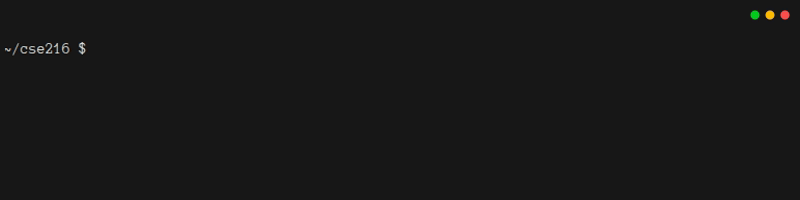
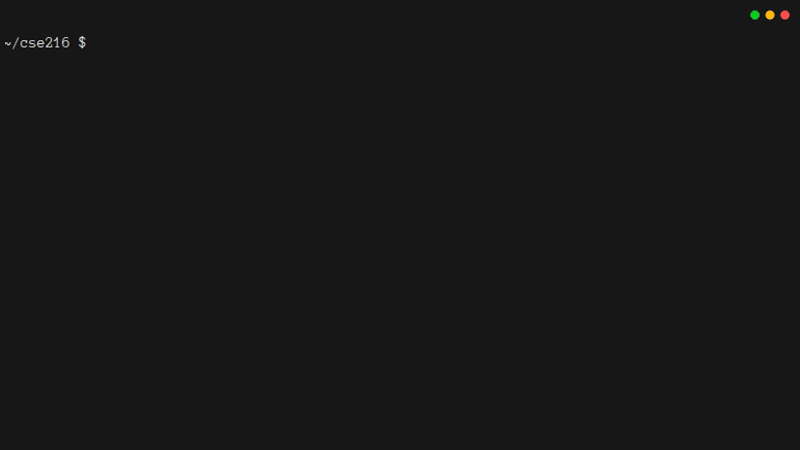
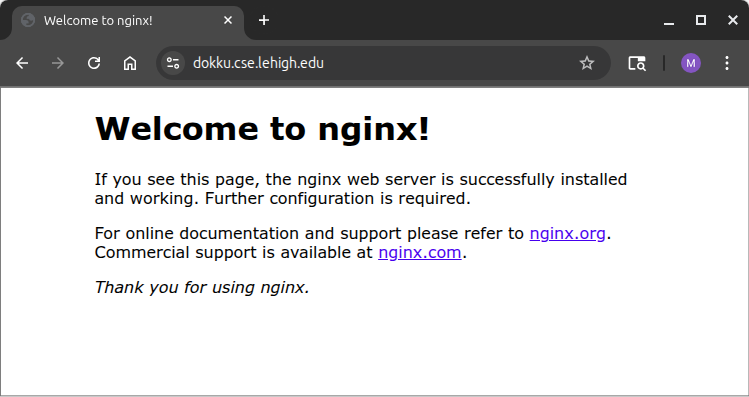
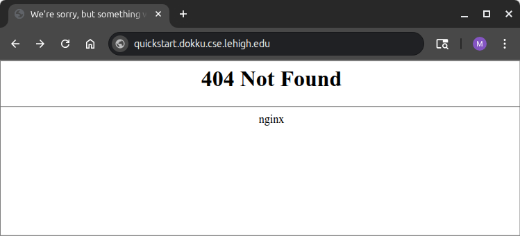
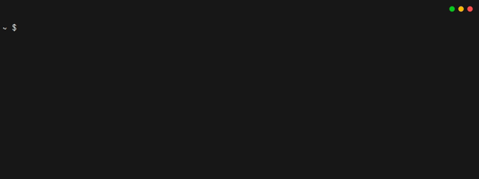
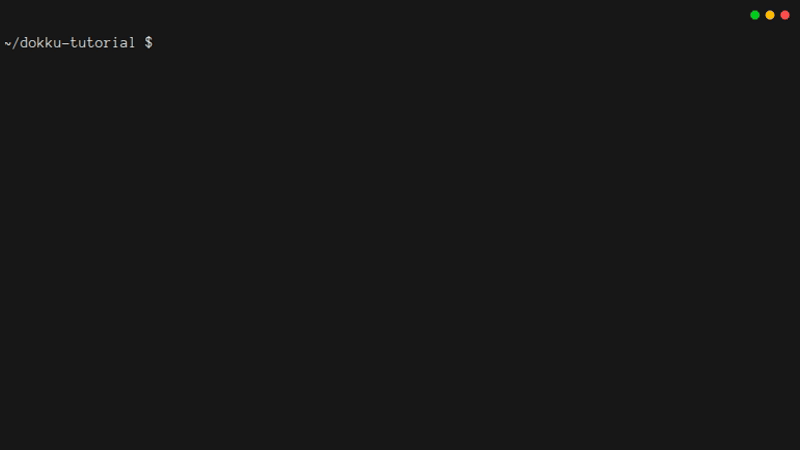
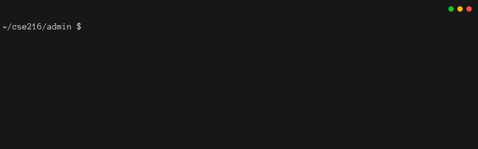

# 4. Deploying To The Cloud

## 4.1. Introduction

The Lehigh CSE department hosts private a [Dokku](https://dokku.com/) instance that you can use to deploy your application.
Dokku is an open-source *Platform as a Service* ([PaaS](https://en.wikipedia.org/wiki/Platform_as_a_service)) provider that is similar to [Heroku](https://www.heroku.com/).
The instructions in this chapter should not need many changes in order to work with Heroku or other Heroku-like cloud PaaS providers.

The changes you'll make to your app in this chapter help to align with the [12 Factor App](https://12factor.net/) principles.
12-factor is, in effect, a *pattern* for DevOps, similar to the way that there are [Software Design Patterns](https://en.wikipedia.org/wiki/Software_design_pattern).

## 4.2. Why Isn't The Code Ready To Deploy?

There are a few problems that will keep your app from running on Dokku right now.

1. The Database:
   Right now the app uses SQLite for the database.
   You will need to switch to a database that runs in the cloud.
   [PostgreSQL](https://www.postgresql.org/) is a popular choice and it's already integrated with the CSE Dokku server.
2. URLs:
   There are a few places where the program expects a `localhost` path.
   Through Dokku, your app will have a url like `http://quickstart.dokku.cse.lehigh.edu`, so you will need to update some configuration (especially OAuth) accordingly.
3. Launch Script:
   Dokku, prefers integrated deployments through git.
   In practice, this means that Dokku will give you a specially configured git repository where you can push ready-to-deploy code, and then it will package that code into a jar and launch it.
   This will require some care to set up.
4. Environment:
   Dokku manages environment variables without a `backend.env` file, so that will need to be set up too.

This chapter will walk you through the process of getting everything to work with Dokku.
When you're done, you'll have made a bunch of one-time fixes to your code, and you'll have a script you can use to deploy your app to Dokku any time it changes.

## 4.3. Testing Your Dokku Configuration

If you are taking CSE 216, you should have been instructed to work with the CSE Department System Administration Staff to set up your *ssh keys* with the Dokku server.[^Dokku_Admin_Note]
After that, you should have been given a name for your project on one of the Dokku servers.
You should also have been given a special "exposed database port" number.
As you work through this chapter, please note that the CSE Dokku servers are only accessible from within the Lehigh network or VPN.

[^Dokku_Admin_Note]:
    At the time this tutorial was written, Dokku Access Control Lists (ACLs) did not work correctly for student accounts unless the app name and the database name were the same.
    For readers who need to administer a Dokku server, the following commands should suffice for creating projects (no additional `dokku acl:add` commands required):

    - `ssh -t dokku@dokku.cse.lehigh.edu 'apps:create quickstart'`
    - `ssh -t dokku@dokku.cse.lehigh.edu 'postgres:create quickstart'`
    - `ssh -t dokku@dokku.cse.lehigh.edu 'postgres:link quickstart quickstart'`

To ensure that your ssh keys are correctly configured, and to see the initial configuration of your app, connect to dokku and run the `config:export` command.
You can do this by typing:

```bash
ssh -t dokku@dokku.cse.lehigh.edu 'config:export quickstart'
```

The result should look like this:



You hopefully recognize what's happening here: Dokku is ready to pass configuration information to your app through environment variables.
Furthermore, there is one environment variable already set up for you: the URL for a pre-configured PostgreSQL database.

Using the command line, you can set and unset environment variables:

```bash
ssh -t dokku@dokku.cse.lehigh.edu 'config:set quickstart DATABASE_FILE=db.db'
ssh -t dokku@dokku.cse.lehigh.edu 'config:export quickstart'
ssh -t dokku@dokku.cse.lehigh.edu 'config:unset quickstart DATABASE_FILE'
ssh -t dokku@dokku.cse.lehigh.edu 'config:export quickstart'
```

The result should look like this:



Remember that your environment variables will be stored by Dokku and passed to your app every time it starts/restarts.
Changing environment variables will cause Dokku to automatically restart your app.
Also, note that the `DATABASE_URL` is **security critical**.
It includes a password, and thus anyone who has the full `DATABASE_URL` and is on the Lehigh network will be able to access your PostgreSQL database.
You'll want to keep it secret!

Right now, your app is not ready to deploy to Dokku, but it would still be good to test out Dokku and make sure it works.
If you try to visit the Dokku server at <http://dokku.cse.lehigh.edu>, you should see this:



However, if you try to visit your app at <http://quickstart.dokku.cse.lehigh.edu>, you'll get an error, because you haven't provided any code for Dokku to run:



## 4.4. Using Git To Launch Dokku Apps

The process of launching a Dokku app is tricky enough that you'll want to practice it with something simple, before you do it with your Javalin-based app.
You might think this would be easy.
After all, your code is in a git repository.
Dokku has a different git repository set up for your app.
If you pushed your code to Dokku's repository instead of yours, Dokku would automatically build your app and start it.

It would seem like using a `git remote` so that your repository could *also* push to Dokku would do the job.
However, since Dokku is hosting your *backend*, it needs your *backend* to be stored in the root of its repository, not in a subfolder.
It seems like a simple problem to fix, but it can rapidly turn into a nightmare.

This tutorial series recommends an *out-of-tree* approach to the problem.
Right now, you have a file structure like this, which corresponds to having checked out the git repository that holds all of your code.
(Note: in the listing below, the git repository is named `cse216`.
Your repository name will be different):

```text
.
└── cse216
    ├── admin
    │   └── ...
    ├── backend
    │   └── ...
    ├── frontend
    │   └── ...
    ├── local
    │   └── ...
    ├── .git
    │   └── ...
    └── .gitignore
```

It doesn't really make sense to put *another* repository inside of this folder, so instead, you are going to make another repository *as a sibling* of the folder where you've checked out your code.
You'll want the result to look like this:

```text
.
├── ccse216
│   ├── admin
│   │   └── ...
│   ├── backend
│   │   └── ...
│   ├── frontend
│   │   └── ...
│   ├── local
│   │   └── ...
│   ├── .git
│   │   └── ...
│   └── .gitignore
└── dokku-tutorial
    ├── .git
    │   └── ...
    └── .gitignore
```

In terms of *how* to make that `dokku-tutorial` folder, you can simply clone it from the Dokku server:

```bash
git clone dokku@dokku.cse.lehigh.edu:quickstart dokku-tutorial
```

The result should look like this:



Dokku is able to host all sorts of different apps.
In fact, it can also host static web sites.
It's easy to set this up, and it will help to show that your server is working.
In the root folder of your `dokku-tutorial` repository checkout, create a file called `index.html`:

<<< @/04_dokku/support/index.html

To tell Dokku that this is a static site, create an empty file called `.static`:

```bash
touch .static
```

Now when you commit and push in this repository, Dokku will automatically start hosting your site.
Type the following three commands:

```bash
git add .static index.html
git commit -m "Created a simple static site, to test Dokku"
git push
```

The output will look something like this.
Note that the process takes a few minutes.
When everything works, you will see the line `=====> Application deployed`.
The output will also report the URIs for your app.


When you visit <http://quickstart.dokku.cse.lehigh.edu> in your browser, you should see your static site:


:::tip Note: HTTP and HTTPS
A production app should only use `https` endpoints.
In some cases the CSE Dokku server provides `http` endpoints instead.
Throughout this chapter, you'll be asked to set things up for `http` and `https`.
If your project requires `https`, be sure to work with the instructor to ensure that you aren't given `http` endpoints by mistake.
:::

Finally, clean up your repository by deleting the files you just made.

```bash
git rm .static index.html
git commit -m "removed static site, so repository is ready for launching the Javalin-based backend"
```

If you type `git push`, you will eventually receive an `App build failed` message:



This is not a bad thing.
Dokku noticed that you tried to push something invalid, and it rejected your push.
You are likely to encounter this often when developing code that runs in the cloud.
Dokku has an expected and reliable way of preventing you from deploying a broken build.

## 4.5. Switching The Admin App To PostgreSQL

Your Dokku instance includes a PostgreSQL database, which is good, since you really shouldn't be using SQLite for a web app.
Now is a good time to switch your admin and backend programs from SQLite to PostgreSQL.
This will involve a few small changes that need to be done in both apps, and a few changes specific to the admin app.
But before you make those changes, it would be a good idea to make sure your database is working.
Otherwise, you might be troubleshooting your Java code when the problem is somewhere else!

In Chapter 1, you saw the `sqlite3` program for command-line interactions with a SQLite database.
The `psql` program does the same, but for PostgreSQL.[^psql_sunlab]
However, if you try to use it to connect to your database, using the `DATABASE_URL` from your app's environment variables, it won't work:

[^psql_sunlab]:
    Note that `psql` is installed on the sunlab, so you should be able to use it even if you are having trouble installing it on your laptop.


It turns out that there are two problems here.
The first is that you need to provide a more exact name for the database when you're trying to connect to it from your laptop.
Instead of `dokku-postgres-quickstart`, you'll need to type the full name `dokku-postgres-quickstart.dokku.cse.lehigh.edu`.
But if you change this, you'll just get a "Connection timed out" error, because there is another issue.
By default, your database is not visible to any program other than your app on the Dokku server.
To make it visible, you need to expose a port.
The default PostgreSQL port is 5432, but since the Dokku server is used by many people simultaneously, you can't use that port.
Instead, you will run a command to expose the port and receive an automatically assigned available external port:

```bash
ssh -t -q dokku@dokku.cse.lehigh.edu 'postgres:expose quickstart'
```

Then you can build a valid URI for accessing your database.
From within `psql`, you can press `ctrl-d` or type `\q` to exit:
The whole process should look like this:


:::tip Note: If you forget your exposed port
If you forget which port was assigned for external access, you have three options:

1. You could `postgres:unexpose` the port and then `postgres:expose` it again.
   This will result in a new port being assigned.
2. If you try to `postgres:expose` the port again, you'll get an error message that includes the currently assigned port.
3. Depending on how Dokku is configured, you might be able to run `postgres:info` to get the exposed port
:::

Now that you know that it's possible to access your postgres database from anywhere, you can update the `admin` app to use it instead of a local sqlite file.
First, edit `pom.xml` by adding a new dependency that provides the required jdbc postgresql driver.
You can add it right after the SQLite dependency:

<<< @/04_dokku/admin_01/pom.xml#postgresql

Next, you'll want to update `Database.java`.
First, update the static initializer to check for the postgresql driver (in addition to the sqlite driver):

<<< @/04_dokku/admin_01/src/main/java/quickstart/admin/Database.java#static_initializer

Then, add a new instance field, and change the constructor

<<< @/04_dokku/admin_01/src/main/java/quickstart/admin/Database.java#new_constructor

In `App.java`, you'll need to add or modify four lines.
First, add a line for reading the `DATABASE_URL` environment variable:

<<< @/04_dokku/admin_01/src/main/java/quickstart/admin/App.java#envar

Then add a line for reporting the new environment variable:

<<< @/04_dokku/admin_01/src/main/java/quickstart/admin/App.java#envar_report

Third, change the line that validates the environment variables:

<<< @/04_dokku/admin_01/src/main/java/quickstart/admin/App.java#validate

Finally, change the line for constructing the database object:

<<< @/04_dokku/admin_01/src/main/java/quickstart/admin/App.java#db_construct

When you type `mvn package`, you'll discover that your unit tests are failing due to an "unresolved compilation problem".
That makes sense, since your unit tests were designed for a SQLite database, and now your database is supposed to use PostgreSQL.
You **should not** simply replace each unit test's body with `assertTrue(true);`.[^use_backlog]
Instead, you should mark the whole class with the `@Disabled` annotation:[^rethink_testing]

<<< @/04_dokku/admin_01/src/test/java/quickstart/admin/AppTest.java#disable_class

[^use_backlog]:
    At a minimum, if you used the `asserTrue(true);` approach it would be wise to mark each change as `// TODO: fixme` and/or add to the backlog the need to redesign the unit testing of `AppTest.java`.

[^rethink_testing]:
    `AppTest.java` is really testing your *database*, not your command line application.
    Most of `AppTest.java` would be more appropriate in `DatabaseTest.java`.
    Then, you could abstract-away database access to an `interface` implemented by `DatabaseSqlite.java` for sqlite (formerly `Database.java`) and a hypothetical `DatabasePostgres.java` for Postgresql.
    Doing so would allow each to be developed and tested independently, and `App.java` would simply use the interface type.
    Another option would be to use a [Factory](https://en.wikipedia.org/wiki/Factory_method_pattern) or [Builder](https://en.wikipedia.org/wiki/Builder_pattern) pattern.
    With any of these approaches, your tests in `AppTest.java` would ensure correct app behavior regardless of the database used.

If you try to provide the `DATABASE_URL` as an environment variable, unfortunately, things still fail, because `DATABASE_URL` is not formatted in a way that the Java PostgreSQL driver understands:

:::tip Note: Is it worth creating `local/admin.env`?
You probably noticed that the `DATABASE_URL` is being provided on the command line, instead of in a `.env` file.
In most cases, using an `.env` file is a better choice.
Among other things, it would keep your `DATABASE_URL` from showing up in your shell history.

However, it's a good idea to `postgres:unexpose` any time you're not actively using your `admin` app.
Every time you `postgres:expose`, your port is going to change, which means you'll need to also change your `.env` file.
Whether using a `.env` file is worth it is up to you to decide.
:::


The solution is to split the `DATABASE_URL` and then connect differently:

<<< @/04_dokku/admin_02/src/main/java/quickstart/admin/Database.java#ctor

You should now be able to run the admin app.
However, please **do not** create any tables yet:



There is one more issue in the admin app.
SQLite and PostgreSQL have slightly different syntax for creating a table with an integer primary key.
This means you'll need to modify the `createTables` method:

<<< @/04_dokku/admin_02/src/main/java/quickstart/admin/Database.java#create_tables

With that change in place, you should be able to run your `admin` app, create tables and views, and then create an entry in `tblPerson` with your Google-friendly email address.

## 4.6. Updating The Backend

The backend also needs to be updated to work with PostgreSQL.
Fortunately, the changes are nearly the same as what you just did for the admin app.
However, your backend will only support postgres.
It will not support sqlite.
That being the case, your backend should keep dependencies to a minimum to reduce build time and jar size.
You can probably do these steps on your own, but they are listed below, just in case you need some help.

First, edit `pom.xml` by *replacing* the SQLite dependency with this:

<<< @/04_dokku/backend_01/pom.xml#postgresql

Next, you'll want to update `Database.java`.
First, change the static initializer:

<<< @/04_dokku/backend_01/src/main/java/quickstart/backend/Database.java#static_initializer

Then replace the constructor, so that it can correctly use the `DATABASE_URL` value:

<<< @/04_dokku/backend_01/src/main/java/quickstart/backend/Database.java#ctor

Finally, edit `App.java`.
You'll need to edit four lines to go from `DB_FILE` to `DATABASE_URL`.
First, change the line for reading the database environment variable:

<<< @/04_dokku/backend_01/src/main/java/quickstart/backend/App.java#envar

Then change the line for reporting the environment variable:

<<< @/04_dokku/backend_01/src/main/java/quickstart/backend/App.java#envar_report

Third, change the line that validates the environment variables:

<<< @/04_dokku/backend_01/src/main/java/quickstart/backend/App.java#validate

Finally, change the line for constructing the database object:

<<< @/04_dokku/backend_01/src/main/java/quickstart/backend/App.java#db_construct

Lastly, you'll want to modify `local/backend.env`, so that it provides the `DATABASE_URL` from Dokku instead of a `DB_FILE` for SQLite.
Since you are likely to still do some development on your laptop, it is fine to leave the `STATIC_LOCATION` environment variable intact, even though you won't use it on Dokku.

:::warning Warning: postgres:expose
Right now, your Postgres database is accessible to anyone who knows the password, because you used `postgres:expose` earlier.
When your app is running on Dokku and you are not actively working on it, you should un-expose it.
The command to do that is `ssh -t -q dokku@dokku.cse.lehigh.edu 'postgres:unexpose quickstart'`

It's important to remember to re-expose any time you're planning on using the admin app, or running the backend from your laptop.
When you do, be sure to note the new port!
:::

## 4.7. OAuth Adjustments

Since the application is going to be visible as `https://quickstart.dokku.cse.lehigh.edu`, you need to update your Google OAuth configuration.
Log into the [Google Cloud Console](https://console.cloud.google.com/), locate your app, and navigate to the OAuth screen ("APIs & Services" -> "Credentials" -> Vue App client ID).
Add the origins `https://quickstart.dokku.cse.lehigh.edu` and `http://quickstart.dokku.cse.lehigh.edu`.
Then add the redirects `https://quickstart.dokku.cse.lehigh.edu/auth/google/callback` and `http://quickstart.dokku.cse.lehigh.edu/auth/google/callback`.

When your app is live, you might decide to remove the `localhost` origin and callback.
For now, they're worth keeping in place since there's more development work to be done.
In general, you can add and delete origins and redirects at any time.

There is one last edit that you'll need to make, in `App.java`.
To web browsers, and to Google OAuth, your app is accessible through an address that starts with https.
The `s` means "secure", and all https traffic is encrypted.
However, when your browser, or Google OAuth, communicates with your app, it goes through a reverse proxy called [nginx](https://nginx.org/).
Nginx is the magic that lets one Dokku server manage hundreds of projects.
For convenience, Lehigh's Dokku servers do not use https between nginx and your app.
This means it's not quite a fully [end-to-end](https://en.wikipedia.org/wiki/End-to-end_encryption) encryption.
For CSE 216, that's fine, and if you were on Heroku, you *would* have end-to-end encryption.

The reason this matters is that Google OAuth is going to send a message to Dokku via `https`, but your app will see it as `http`.
Thus in the `app.before` handler in `App.java`, you'll need to modify the path you check, by replacing `https` with `http`:

<<< @/04_dokku/backend_01/src/main/java/quickstart/backend/App.java#fix_oauth_url

## 4.8. Getting Ready To Run On Dokku

The way you will deploy your app is by copying files to your `dokku-tutorial` repository and then doing a `git push`.
That will cause Dokku to run `mvn package` to build the jar.
Then Dokku will try to run the jar.
In order for this to work (and assuming your app's dokku environment variables are correct), two files **must** exist in the root of your `dokku-tutorial` repository: `Procfile` and `system.properties`.
These file names are **case sensitive**.
Please be sure to name them correctly.[^on_filename_case_sensitivity]

[^on_filename_case_sensitivity]:
    You should generally assume that filenames are case-sensitive (e.g. it would be incorrect to use `procfile` when `Procfile` is specified)

You will need to create, maintain, and version control these.
The easiest thing to do is create them in the `./backend/` folder, so that they are easy to find when you are ready to copy files to the `dokku-tutorial` repository.

The first file you need is called `Procfile`; its line endings **must** be LF not CRLF.
The `Procfile` tells Dokku that your program is a `web` application, so that Dokku opens the right ports for HTTP traffic.
It also tells Dokku how to run your web application (i.e., using the `java` executable to run the `quickstart.backend.App` class from the `target/backend-1.0.jar` jar it will build).

<<< @/04_dokku/support/Procfile{txt}

Because the line endings of `Procfile` are important for correctness, you should **not** leave its encoding to chance.
If you have the wrong line endings, Dokku will not be able to correctly interpret the file.
It will think your Java class name ends with `\r`.
This will be hard to debug, because it is not easy for you to see when it is printing that "non-printing" character in a debug message.
A best practice is to use a `.gitattributes` file.
Below is `backend/.gitattributes`, which assumes that `Procfile` is also in the `backend` folder.
You should be sure to `git add` and `git commit` this file alongside of your `Procfile`.

<<< @/04_dokku/support/.gitattributes{txt}

:::tip
You probably will want to use `.gitattributes` to specify the line endings for any scripts you create, too.
:::

The other file you need to add, `system.properties`, tells Dokku which version of Java to use.[^dokku_system_properties]
It, too, is only one line:

<<< @/04_dokku/support/system.properties

[^dokku_system_properties]:
    Without this file, Dokku picks its [Java 8](https://devcenter.heroku.com/articles/java-support#specifying-a-java-version).
    Your backend's `pom.xml` is already following best practice in specifying a recent LTS version: `<maven.compiler.release>17</maven.compiler.release>`.
    Choosing an older LTS version helps to minimize hosting requirements, if you ever deploy your app somewhere other than the CSE Dokku servers.
    If your backend or its dependencies need newer features, you'll need to update `pom.xml` and also `system.properties`.

Next, you'll want to set up your environment variables on Dokku.
You only need to provide the variables that Dokku does not provide automatically.
That means you don't need to provide `DATABASE_URL` or `PORT`.
In addition to the OAuth information, make sure you provide the name of your server, since it is used to construct the callback URL for Google OAuth:

```bash
ssh -t dokku@dokku.cse.lehigh.edu 'config:set quickstart CLIENT_ID=xxxxxxxxxxxx-xxxxxxxxxxxxxxxxxxxxxxxxxxxxxxxx.apps.googleusercontent.com'
ssh -t dokku@dokku.cse.lehigh.edu 'config:set quickstart CLIENT_SECRET=xxxxxx-xxxxxxxxxxxxxxxxxxxxxxxxxxxx'
ssh -t dokku@dokku.cse.lehigh.edu 'config:set quickstart SERVER_NAME=https://quickstart.dokku.cse.lehigh.edu'
```

You can see that these worked by typing:

```bash
ssh -t dokku@dokku.cse.lehigh.edu 'config:export quickstart'
```

## 4.9. Deploy To Dokku

At last, it is time to deploy to Dokku.
Below is a script (`local/push_dokku.sh`) that you can edit.
The first time you deploy your app, though, you should type each line, so that you can easily find bugs.
Also, make sure you're on the Lehigh network or VPN when running these commands.

<<< @/04_dokku/support/push_dokku.sh

:::warning Warning: Don't interrupt `git push`
Dokku is prone to misbehavior if you press `ctrl-c` in the middle of a `git push`.
It usually takes intervention from the CSE System Administrator to get things back in order for your project.
If you unintentionally `git push`, please **do not** interrupt it.
Just let it finish, then fix your mistakes and push again.
:::

If everything worked, then after a few seconds you should see a message that your app was built by the Dokku server, and was successfully started.
If anything is wrong, you might see an error in your console, or you might need to check the logs by typing:

```bash
ssh -t dokku@dokku.cse.lehigh.edu 'logs quickstart'
```

Once everything is working, you should be able to visit your website, using an address that starts with `https` or `http`[^oneof_https_http], and interact correctly with the program.
[^oneof_https_http]:
    You can use `https` if your app supports it, `http` if it does not -- see the `=====> Application deployed:` section of your server output to be sure.

## 4.10. Finishing Up

The commit and push that sent your app to Dokku *did not* commit your code changes to your code repository, so if you haven't committed them and pushed, now is a good time to do that!
When you do, remember that you will should not commit the `resources/public` folder in your backend.
It gets re-built from the frontend any time you need it.
But you probably don't want to use a .gitignore for that, since you want to push the resources to Dokku.

:::warning Warning: Security and Safety
If you haven't used `postgres:unexpose` to prevent access to your database, now is a good time to do so.
You might also want to consider removing the `localhost` options in your Google OAuth configuration if you are done developing.
:::

Once you've got everything in a good place, it's time to celebrate!
You've successfully made a secure web application using PostgreSQL, Vue.js, and Javalin.
You launched it to a cloud PaaS service.
You have developed a satisfactory understanding of the "tech stack" so that you can make meaningful contributions to your team project.
You should also have a solid code foundation that you can copy and paste in order to start new projects, unrelated to CSE 216.[^on_license]
[^on_license]:
    You should always pay attention to the licensing of any code you are given or code samples you are using.
    As a general rule of thumb, always provide clear attribution for anything that is not your own, or on which your work is substantially derived.

## 4.11. Getting Ready For Your Next Project

There are many exciting directions to take your code.
But first, you might want to make sure you didn't miss anything.
Here are the updated versions of files from `admin`:

::: code-group
<<< @/04_dokku/admin/pom.xml

<<< @/04_dokku/admin/src/main/java/quickstart/admin/App.java

<<< @/04_dokku/admin/src/main/java/quickstart/admin/Database.java
:::

Here are the updated versions of files from `backend`:

::: code-group
<<< @/04_dokku/backend/pom.xml

<<< @/04_dokku/backend/src/main/java/quickstart/backend/App.java

<<< @/04_dokku/backend/src/main/java/quickstart/backend/Database.java
:::

In addition, you needed these three files in your `backend` folder:

::: code-group

<<< @/04_dokku/support/Procfile{txt}

<<< @/04_dokku/support/system.properties

<<< @/04_dokku/support/.gitattributes{txt}
:::

As you move forward, there are many things to keep in mind.

- The code in this tutorial is secure and thread-safe, but it is not concurrency-optimal.
  You might want to look into connection pooling to improve the performance of the database.
- The tutorial did not get into scale-out.
  Dokku will let you run multiple instances of the backend, if demand gets too high.
- The app is reliant on the `Sessions` object, though.
  If you want to have more than one instance of the backend, you'll want to migrate `Sessions` to a memory cache.
- If you're going to start working on a team, you'll want to give some thought to how to organize your code repository.
  You may want separate branches for `frontend`, `backend`, and `admin` work.
- If you're going to add a lot of features, you'll definitely need better unit tests for the backend and admin apps.
  In addition, you'll need to develop a plan and choose a framework for unit testing the frontend code.

## Footnotes
